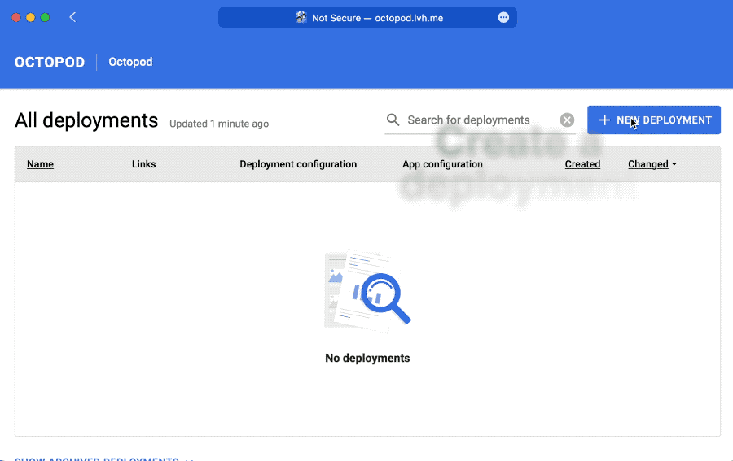

<p align="center">
   <a href="#"></img></a>
</p>

<p align="center">
   <a href="https://github.com/typeable/octopod/actions?query=workflow%3ABuild"></a>
   <a href="https://github.com/typeable/octopod/actions?query=workflow%3ADocumentation+branch%3Amaster"></a>
</p>

_Octopod_ is a fully open-source self-service portal which empowers your team to leverage the full power of Helm without the need for technical expertise.

Octopod is a way for you to provide a self-service portal for managing instances of a service in your cluster. Anything you can describe in a Helm Chart, any member of team can deploy. No matter how complex the deployment process is.

The recipe is simple: you provide a url to your Helm repo, Octopod then automatically extracts the possible configuration that the Chart can have, and automatically manages the lifecycle of the services. What users see is just a simple web interface:

## 🖥 Demo

<p align="center"></img></p>

## 🧑‍🔬 Try it out for yourself

You can have the installation from the demo above running on your local machine in minutes by running the following command:

```bash
/bin/bash -c "$(curl -fsSL https://raw.githubusercontent.com/typeable/octopod/master/octopod_local_install.sh)"
```

You can dive deeper into the installation process in our [deployment guide](docs/en/Octopod_deployment_guide.md).

<details>
<summary>You can remove everything the command above installs by running the following command:</summary>

```bash
kind delete cluster --name octopod
```

</details>

## Motivation

We created _Octopod_ because we believe that everything we release should be rigorously tested, however, such desires greatly [complicate the development workflow](docs/en/PM_case_study.md) leading to longer release cycles.

The members of our team that facilitate rigorously testing are also the member that require the most attention from our DevOps engineers to manage the many staging environments required for a proper testing cycle.

With Octopod we were able to reduce the reliance on our DevOps teams for testing to practically zero, while increasing the DevOps maneuverability of our QA engineers and process.

## 📑 Documentation

### 🔭 High-level notes
- [🐙 Overview](docs/en/Overview.md)
- [🧑‍🔬 Project management case study](docs/en/PM_case_study.md)
- [🧑‍💻 Technical case study](docs/en/Tech_case_study.md)

### 🛠️ Technical documentation
- [🏗 Technical architecture](docs/en/Technical_architecture.md)
- [⚙️ Control script guide][cs]
- [🔧🐙 Octopod deployment guide](docs/en/Octopod_deployment_guide.md)
- [🔧🚀 Helm-based Octopod project setup](docs/en/Helm-based_deployment_guide.md)
- [🐙🎛 octo CLI user guide][octo]
- [🤖 CI integration](docs/en/Integration.md)
- [🔒 Octopod security model](docs/en/Security_model.md)

## ℹ️ FAQ

### How long does it take to set up _Octopod_?

Deploying Octopod itself can be done in a matter of minutes if you have a Kubernetes cluster at hand. If you want to deploy it locally we have [a handy script](docs/en/Octopod_deployment_guide.md#if-you-want-to-try-it-locally) that sets everything up automatically.

After you have Octopod up and running the only thing you need is a Helm Chart that your team might want to deploy. That's it.

### Will _Octopod_ work with my project if it uses X?

Yes. _Octopod_ is project-agnostic. If you can run your project in a Docker container, then you can use _Octopod_ with that project.

### Does _Octopod_ work with "vanilla" Kubernetes projects that don't use Helm?

If you do not have Helm Charts for your projects, you will not be able to leverage the simple Octopod installation procedure we have developed.

To use _Octopod_ with your project will need to either:

- Write Helm Charts for your project
- Write a set of [_control scripts_][cs] that deploy "vanilla" Kubernetes services

You can always contact us if you need help. A good first place to ask questions is [Octopod Discussions](https://github.com/typeable/octopod/discussions).

### What do I need to know to set up Octopod?

You need to understand the basics of _Kubernetes_ and be familiar with whatever hosting provider you will be using.

### What separates Octopod from exiting solutions like Gitlab Dynamic Environments?

Most existing solutions like Gitlab Dynamic Environments offer you an extension of CI/CD pipelines. All they do is allow you to run bash scripts.

This has several drawback the main of which is the fact that you need to understand the under-the-hood details of the deployment process to use them. Existing solutions don't abstract the deployment process. They package up steps of deployment. The user is still responsible for coordinating the steps. You still need to manually manage the state of your deployed services.

Observability and transparency of the deployment management process is another drawback. To inspect the state of a deployed system you need to drop down to the Kubernetes level. At that point you alienate anyone without DevOps expertise. This is the problem Octopod solves.

Octopod _actually_ abstracts the under-the-hood detail like Helm, Kubernetes and Docker from the user into an intuitive and easy to understand model. This allows anyone to manage and deploy services.

### Octopod is great, but my service deployment lifecycle is slightly different.

Octopod was developed in a modular way from the very start. It offers specific extension points called _control scripts_ that allow you to modify the behavior of Octopod. The _control scripts_ can be implemented in any programming language, even Bash. You can read more about _control scripts_ in our [_control script guide_][cs].

We have developed [a generic set of _control scripts_](helm-control-scripts/) that should work great with any Helm Chart. You can use them as a base for your custom _control scripts_.

### Does _Octopod_ work with my CI?

Yes. If you can run arbitrary executables in your CI, then you will be able to integrate it with _Octopod_. Integration basically consists of calling our _octo CLI_ tool to perform desired actions. You can find more detail in the [CI integration](docs/en/Integration.md) doc.

### How come I can't see the deployment logs in Octopod web app?

It's been excluded from the GUI because we don't have a good security story to accompany this feature yet. Some secrets and credentials may leak to the project team using Octopod and, potentially, not everyone should have access to this data.

### Octopod says "Failure" next to my deployment. Why is it not working?

There are several places where things can go wrong:

1. Your DevOps engineer could have made mistakes in one of the [_Control Scripts_][cs] leading to an improper deployment process.

   To fix this the DevOps engineer can use the [_octo CLI_][octo] to see detailed logs collected during the deployment process and diagnose the issue.
2. You could have one of the steps of your deployment failing (for example, a failing database migration).

   If you have supplied a [_Kubernetes Dashboard_](https://kubernetes.io/docs/tasks/access-application-cluster/web-ui-dashboard/) URL to _Octopod_ during deployment, then you will have a "Details" button in the _Web UI_. You can click that button to get a filtered view of the _Kubernetes Dashboard_ where you can see what could have gone wrong and diagnose the issue.


## Quotations

> Typeable team envisioned an insightful approach to CI/CD, which managed to help us cut the delivery time for new features and projects with Octopod

— Wes Iwanski – VP Technology, Downtown Travel

## ❓ Still have questions?

If you still have questions, be sure to ask them in our [Octopod Discussions](https://github.com/typeable/octopod/discussions).


<center>

##### Star the project of you like it

</center>

<p align="center"><a href="https://typeable.io"></img></a></p>

[cs]: docs/en/Control_scripts.md
[octo]: docs/en/Octo_user_guide.md
