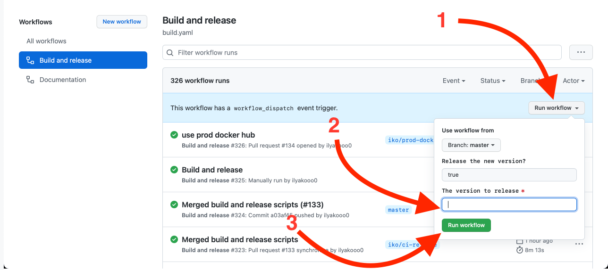

# Release checklist

1. Update the referenced tags in the documentation
2. If there were changes to control scripts:
   1. _**\<TODO\>**_
3. [Dispatch the "Build and release" workflow](https://github.com/typeable/octopod/actions/workflows/build.yaml), specifying the version you are releasing:

   
