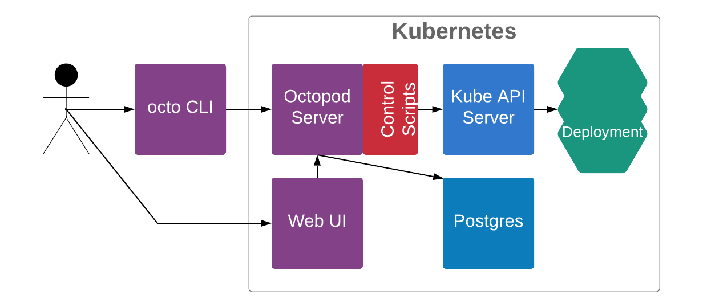

# Technical architecture

## Used tools

DM разворачивается в Kubernetes и используется для разворачивания новых stagings в Kubernetes.

Для хранения настроек и логов действий пользователей используется PostgreSQL.

## App architecture

UI - веб интерфейс,
используется для управления стейджингами посредством отправки команд управления стейджингами.
Взаимодействует с DMS посредством отправки HTTP/1.1 запросов, а так же получает
события от DMS по Websocket. Между UI и DMS Basic Auth. Написан на Haskell и Reflex-Dom.

DMS - сервер обрабатывает
команды управления стейджингами от DMC и UI, обновляет состояние стейджингов.
DMC и UI взаимодействуют с ним путем отправки HTTP/1.1 запросов.
Сервер шлет событие обновления на UI по Websocket. Сервер взаимодействует с Kube API Server
через контейнер с утилитами (app wrappers).  Для хранения настроек и статусов стейджингов,
и логов действий пользователей используется PostgreSQL. Написан на Haskell. Для работы
со стейджингами использует контейнер с утилитами (app wrappers).

PostgreSQL - РСУБД для хранения настроек и статусов стейджингов, и логов
действий пользователей.

DMC - консольный клиент
используется для управления стейджингами посредством отправки команд управления
стейджингами. Взаимодействует с DMS посредством отправки HTTP/1.1 запросов.
Написан на Haskell. Между DMC и DMS аутентификация по сертификату,
новый сертификаты создается вовремя каждой сборки и упаковываются в контейнеры с DMC и DMS.

Контейнер с утилитами (app wrappers) - контейнер с исполнямыми файлами, в которые инкапсулирована
логика работы со облачными провайдерами, стейджингами, системами контроля версий и т.д.
Во время старта пода DMS содержимое контейнера с утилитами копируется в ФС контейнера с DMS,
поэтому исполняемые файлы должны быть либо интерпретируемы через Bash, либо статически слинкованны.
Логику исполняемых файлов предлагается реализовать пользователям DM (смотри раздел [Files of app wrappers](#Files of app wrappers)).

Clean Archive CronJob - CronJob, которая запускается раз в час
и через DMC удаляет заархивированные стейджинге старее 14 дней.

Kubernetes (https://kubernetes.io/docs/home/) - распределенная система для
оркестрации контейнерами.

Kube API Server - сервер обрабатывающий HTTP/1.1 запросы. Точка входа для
взаимодействия с Kubernetes.

## Files of app wrappers

### create

Реализация создания нового стейджинга.

Получает на вход следующие аргументы:
* --project-name - название проекта
* --base-domain - базовый домен
* --namespace - namespace
* --name - имя стейджинга
* --tag - тег стейджинга
* --app-env-override - override уровня приложения (формат значения FOO=BAR, может быть передано 0 или более раз)
* --staging-override - override уровня стейджинга (формат значения FOO=BAR, может быть передано 0 или более раз)

Успешность операции определяется по exit code (0 - успех).

### update

Реализация обновления стейджинга.

Получает на вход следующие аргументы:
* --project-name - название проекта
* --base-domain - базовый домен
* --namespace - namespace
* --name - имя стейджинга
* --tag - тег стейджинга
* --app-env-override - override уровня приложения (формат значения FOO=BAR, может быть передано 0 или более раз)
* --staging-override - override уровня стейджинга (формат значения FOO=BAR, может быть передано 0 или более раз)

Успешность операции определяется по exit code (0 - успех).

### delete

Реализация удаления стейджинга.

Получает на вход следующие аргументы:
* --project-name - название проекта
* --namespace - namespace
* --name - имя стейджинга

Успешность операции определяется по exit code (0 - успех).

### check

Реализация проверки состояния стейджинга.

Получает на вход следующие аргументы:
* --namespace - namespace
* --name - имя стейджинга

Успешность операции определяется по exit code (0 - успех).

### cleanup

Реализация очистки ресурсов стейджинга.

Получает на вход следующие аргументы:
* --project-name - название проекта
* --namespace - namespace
* --name - имя стейджинга

Успешность операции определяется по exit code (0 - успех).

### archive_check

Реализация проверки успешности удаления стейджинга.

Получает на вход следующие аргументы:
* --namespace - namespace
* --name - имя стейджинга

Успешность операции определяется по exit code (0 - успех).

## DM Distribution model

DMC поставляется упаковынным в Docker образ или в виде статически скомпилированного файла (не решили как лучше).

DMS и UI поставляются упаковынными в один Docker образ. Для развертывания в Kubernetes используется набор Chart-ов.

## App distribution model. Deployment guide link.

## Primary processes

Команды управления стейджингами:
* create - создание нового стейджинга.
  В качестве аргументов принимаются `name`, `tag` и опциональные `overrides` (уровня App или Staging, открытие или секретные).
* update - обновление существующего стейджинга.
  В качестве аргументов принимаются `name`, `tag` и опциональные `overrides` (уровня App или Staging, открытие или секретные). 
* delete - архивирование существующего стейджига.
  Производится удаление только подов, Persistent Volumes (диски) сохраняются. Отменить действие этой команды можно с помощью команды restore.
  В качестве аргументов принимаются `name`. 
* cleanup - полная очистка стейджинга.
  Удаление сертификатов, Persistent Volume Claim и Persistent Volumes.
  В качестве аргументов принимаются `name`. 
* restore — восстановление заархивированного стейджинга.
  Восстановление заархивированного стейджинга с последними настройками.
  В качестве аргументов принимаются `name`. 

## Synchronous and Asynchronous process diagrams

### Create via CLI

### Create via UI

### Update via CLI

### Update via UI

### Delete via CLI

### Delete via UI

### Ceanup via CLI

### Ceanup via UI

### Restore via CLI

### Restore via UI

## How we use it

Мы используем несколько кластеров Kubernetes: отдельный кластер для каждого приложения, а так же разделяем по кластерам prod и staging окружения.

В каждый staging кластер мы устанавливаем DM, через DM осуществляем разворачивание различных версий staging'ов необходимых для QA.

## Security model link

## Per staging statuses and status changes

Существует 6 статусов стейджигов:
1. Running
2. Failure
3. CreatePending
4. UpdatePending
5. DeletePending
6. Archived

Running, Failure, Archived являются постоянными, т.е. стейджинг уже не находится в режиме выполнения команды.

CreatePending, UpdatePending, DeletePending являются переходными, т.е. стейджинг находится в режиме выполнения команды.

