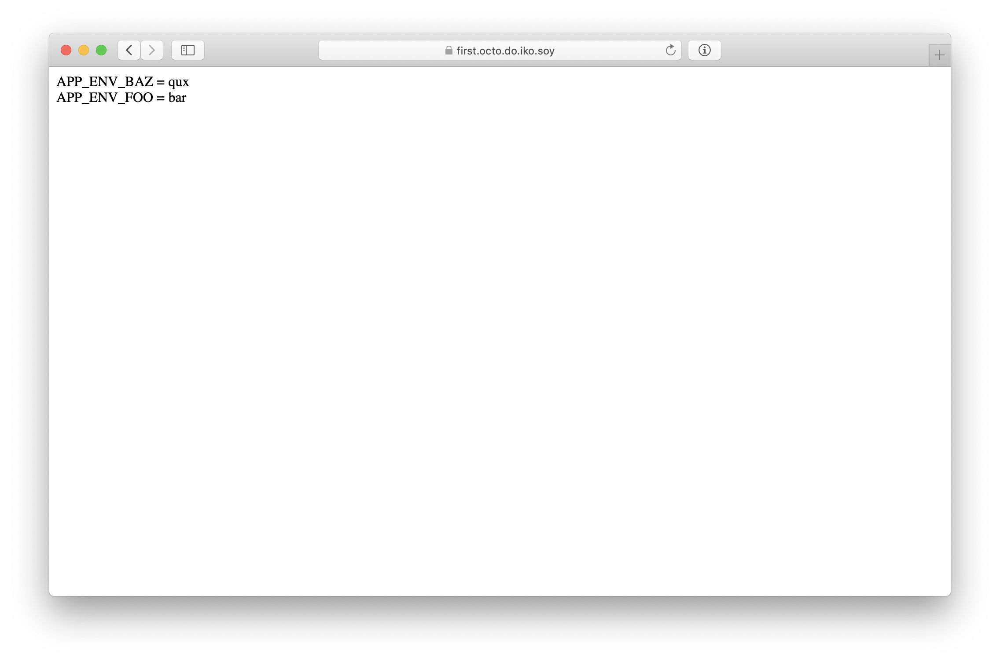

# Helm-based deployment guide

<details>
  <summary>Table of contents</summary>

- [The web application](#the-web-application)
- [Setting up Octopod](#setting-up-octopod)
  - [Control scripts](#control-scripts)
  - [A word about TLS](#a-word-about-tls)
  - [Deploying Octopod](#deploying-octopod)
- [Testing out the deployment](#testing-out-the-deployment)
  - [Setting up _octo CLI_](#setting-up-octo-cli)
    - [Setting up certificates](#setting-up-certificates)
    - [Setting up the API URL](#setting-up-the-api-url)
  - [Creating a deployment](#creating-a-deployment)
  - [Adding an override](#adding-an-override)
  - [Updating the deployment version](#updating-the-deployment-version)
  - [Changing the number of replicas](#changing-the-number-of-replicas)

</details>

In this guide, we will examine a very simple web application and explore setting up _Octopod_ to deploy it.

## The web application

The web application we will be using is a very simple application that serves a single endpoint `/`. The returned HTML markup contains the environment variables the executable has read from the environment. The only variables returned are the ones whose name starts with `APP_ENV`.



The source code can be found in the [examples/web-app](../../examples/web-app) folder of this repository.

You can also find a second version of the server in the [examples/web-app-v2](../../examples/web-app-v2) folder of this repository. The second version is identical to the first version with the only difference being that it returns the variables as an unordered list.


We have already built and pushed the two versions of the application into the [typeable/octopod-web-app-example](https://hub.docker.com/repository/docker/typeable/octopod-web-app-example) DockerHub registry under the `v1` and `v2` tags.

## Setting up Octopod

### Control scripts

The only thing you need to do to configure _Octopod_ to work with your application is to write appropriate [_control scripts_](Control_scripts.md) to manipulate your deployments. We have already written the appropriate _control scripts_ for this application. You can find them in the [examples/helm-based-control-scripts](../../examples/helm-based-control-scripts) folder of this repository. The scripts are written in the _Rust_ programming language.

The most interesting of them all is the [create.rs](../../examples/helm-based-control-scripts/src/bin/create.rs) script. The basic order of operations is:

1. Read the passed command-line arguments
2. Clone the repo to get the _charts_ used to deploy the application with _helm_
3. Generate the arguments that should be passed to _helm_
4. Call _helm_ with the downloaded _charts_ and the generated arguments

> 💡 **NOTE:** You might have noticed that there is no `update.rs`. That is because our application is stateless and packaged up into a single _chart_. This allows us to simply reuse the same script for both creating and updating a deployment. If you have a more complicated setup with a database, for example, you will most likely need a distinct implementation for `update`.

### A word about TLS

If you are deploying Web applications, as we are here, you probably want to use TLS to encrypt your connections to your deployment. The most straightforward way of doing this is generating a separate TLS certificate for every deployment (for every subdomain). [_Cert Manager_][cert-manager] creates TLS certificates through [_Let’s Encrypt_][lets-encrypt] and [_Let’s Encrypt_][lets-encrypt] has [a limit on the amount of certificates][lets-encrypt-rate-limits] you can issue within a given time interval. If you exceed this limit you will start getting a _too many registrations for this IP_ error. If that is the case moving the [_Cert Manager_][cert-manager] _Pod_ might help.

### Deploying Octopod

To deploy _Octopod_ you will need to follow the [_Octopod_ deployment guide](Octopod_deployment_guide.md). The only modification will be that you will replace the "Control Scripts Setup" section in the last step with the appropriate values.

These values point to a docker registry where we have already packaged up these _control scripts_ into a _Docker Image_.

```bash
#################################################
# Control Scripts Setup
#
# if you are just testing things out you can paste the values
# from the Helm Deployment Guide example
#################################################

# The name of the registry with control scripts
utils_registry="typeable"

# The name of the image with control scripts
utils_image="octopod-helm-example"

# The tag of the image to use
utils_image_tag="1.1"
```

## Testing out the deployment

### Setting up _octo CLI_

Using the Web UI is fairly straightforward, so we will examine creating deployments with the [_octo CLI_](Octo_user_guide.md).

#### Setting up certificates

You will need to get the paths to `client_cert.pem` and `client_key.pem` generated in the [Creating SSL certificates](Octopod_deployment_guide.md#creating-ssl-certificates) step and place them into `TLS_CERT_PATH` and `TLS_KEY_PATH` environment variables:

```bash
export TLS_CERT_PATH=/tmp/octopod/certs/client_cert.pem
export TLS_KEY_PATH=/tmp/octopod/certs/client_key.pem
```

#### Setting up the API URL

You will also need to set the power API URL (the `power_app_domain` value from the [Installing _Octopod Server_](Octopod_deployment_guide.md#installing-octopod-server) section) as the `OCTOPOD_URL` environment variable:

```bash
export OCTOPOD_URL=<power_app_domain>
```

### Creating a deployment

To create a deployment you can now run:

```bash
$ octo create -n hello-octopod -t v1 -e APP_ENV_KEY1=VALUE1
```

The options are:
- `-n hello-octopod` – specifies that the name (subdomain) of the deployment should be `hello-octopod`
- `-t v1` specifies the version (Docker Image Tag) of the application to deploy to be `v1`
- `-e APP_ENV_KEY1=VALUE1` specifies adds an application-level key-value pair `APP_ENV_KEY1=VALUE1`

> 💡 **NOTE:** For more detail on _octo CLI_ options please see the [octo CLI user guide](Octo_user_guide.md).

This will run the `create` _control script_, which in turn will call `helm`. After waiting a couple of seconds you can visit `http://hello-octopod.<base_domain>` to see the running application:


You can also see the deployed pod in the cluster using `kubectl`:

```bash
$ kubectl get pods -n deployment
NAME                              READY   STATUS    RESTARTS   AGE
app-hello-octopod-8965856-qbwvq   1/1     Running   0          15s
```

### Adding an override

You can modify deployments by adding or removing overrides. To add a new application-level override run:

```bash
$ octo update -n hello-octopod -t v1 -e APP_ENV_KEY2=VALUE2
```

This will run the `update` _control script_ (which is identical to the `create` script in our case), which in turn will call `helm`. After waiting a few seconds you visit the deployment URL again and see the redeployed version:


### Updating the deployment version

You can change the version (_Docker Image Tag_) of your deployment like so:

```bash
$ octo update -n hello-octopod -t v2
```

After waiting a few seconds you visit the deployment URL again and see the redeployed version:


### Changing the number of replicas

You can change the number of replicas of your deployment (this is [essentially implemented in the _charts_ that we use](../../examples/web-app/charts/web-app/templates/deployment.yaml#L7)) like so:

```bash
$ octo update -n hello-octopod -t v2 -o replicas=3
```

`-o replicas=3` adds a deployment-level key-value pair (override) `replicas=3`.

You can verify that the new replicas have been deployed using `kubectl`:

```bash
$ kubectl get pods -n deployment
NAME                              READY   STATUS    RESTARTS   AGE
app-hello-octopod-8965856-qbwvq   1/1     Running   0          97m
app-hello-octopod-8965856-v585c   1/1     Running   0          15s
app-hello-octopod-8965856-v88md   1/1     Running   0          15s
```

[cert-manager]: https://cert-manager.io/docs
[lets-encrypt]: https://letsencrypt.org
[lets-encrypt-rate-limits]: https://letsencrypt.org/docs/rate-limits
