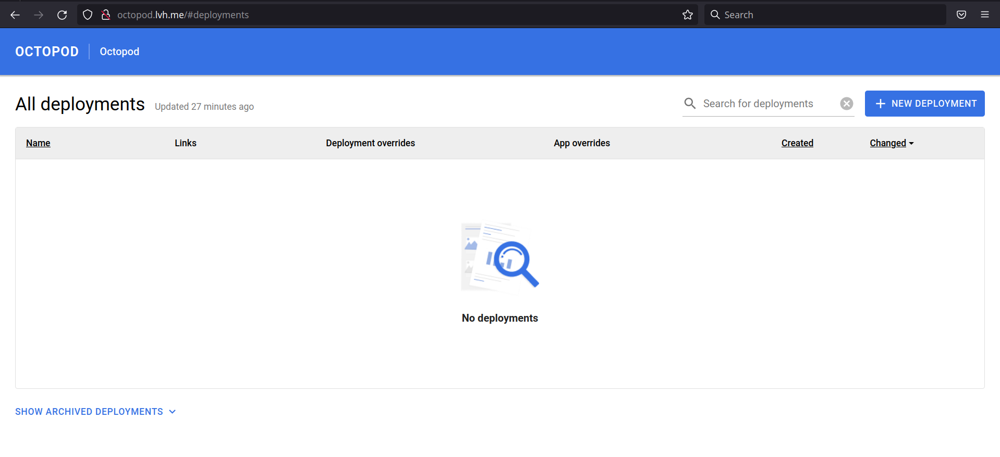
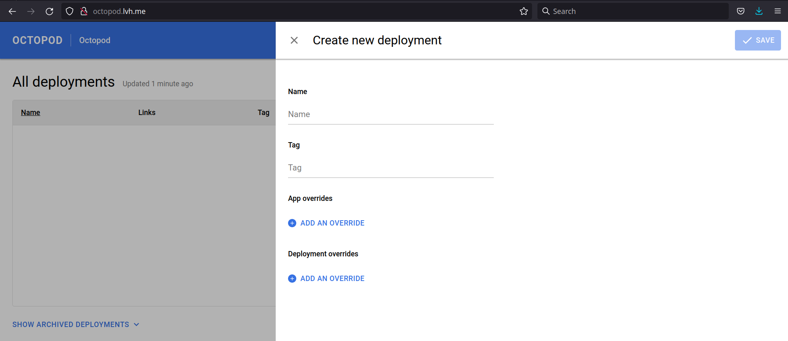
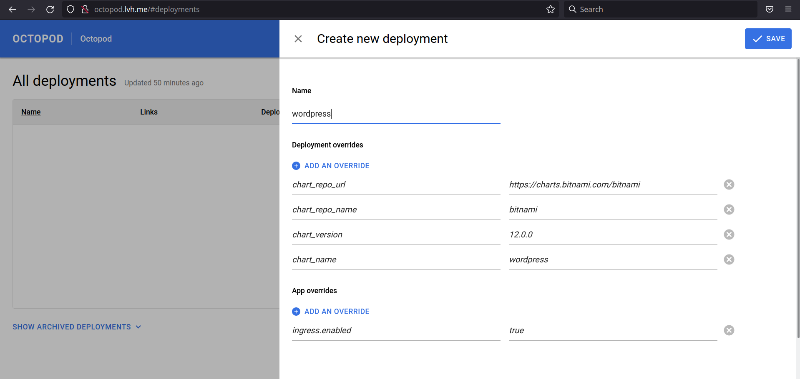
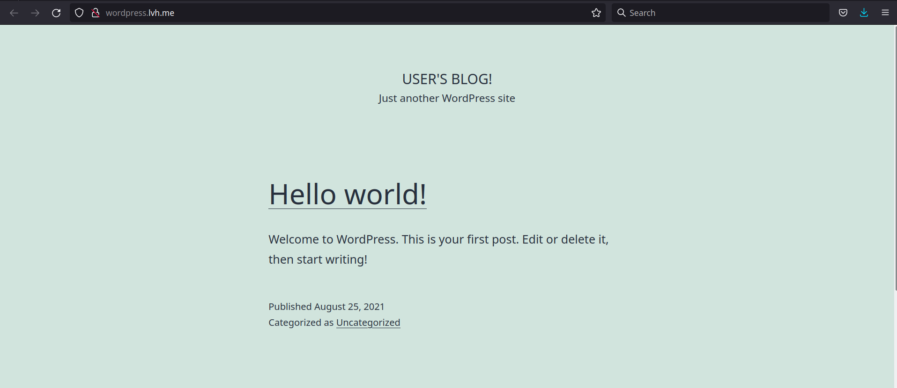
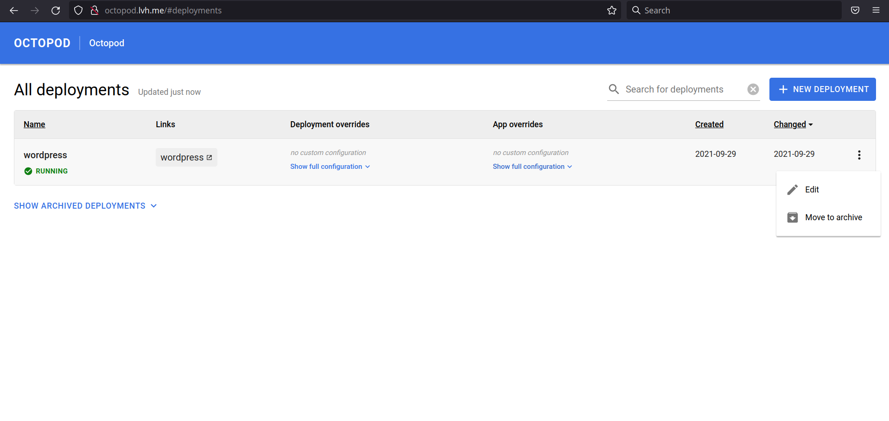
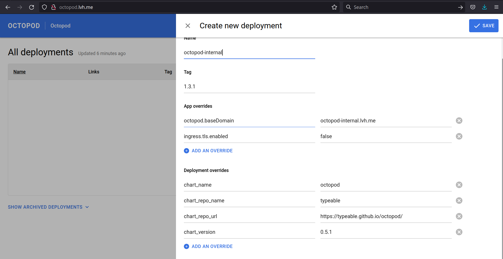

# Helm-based deployment guide

In this guide we'll show you how to deploy bitnami's [wordpress chart](https://github.com/bitnami/charts/tree/master/bitnami/wordpress) with Octopod.

## Your first deployment

Make sure that you have Octopod installed before going further. If you haven't go check our [guide](Octopod_deployment_guide.md).
Note: In this guide we assume that you have octopod installed on your local machine.
Open up Octopod in your browser and you'll see something like this:

Click on the New Deployment button.

Here you can fill your deployment parameters. Let's have it filled up!

Name - we've chosen `wordpress`, but you can choose whatever name you like.

Tag - `5.8.0`. We took the tag name from [chart parameters](https://github.com/bitnami/charts/blob/master/bitnami/wordpress/Chart.yaml#L4)

App Overrides:
`ingress.enabled: true`
`ingress.hostname: wordpress.lvh.me`

We took these overrides from [chart documentation](https://github.com/bitnami/charts/tree/master/bitnami/wordpress#traffic-exposure-parameters). Basically you can tweak any parameters from there.

When you have it all filled up. Click Save button and wait until deployment will get to a running state.

Now you can click on a wordpress link in the links section and you'll be redirected to your wordpress instance.

So here you have it, your first Octopod deployment!

## Going further

Right now you can be wondering, how did Octopod take wordpress from bitnami repository when we haven't filled any repo information whatsoever? This is because we've set this up on a chart level [here](../../charts/octopod/values.yaml#L90)
You can override all this using deployment overrides. Let's dive right in!
First move our wordpress deployment to archive

And create one more deployment, this time using a bit different set of overrides.

Name: octopod-internal

Tag: 1.3.1

App Overrides:

`octopod.baseDomain: octopod-internal.lvh.me`
`ingress.tls.enabled: false`

Deployment Overrides:

`chart_name: octopod`
`chart_repo_name: typeable`
`chart_repo_url: https://typeable.github.io/octopod/`
`chart_version: 0.5.1`

As in the previous example we took App Overrides from [chart documentation](../../charts/octopod#parameters), but Deployment Overrides are passed as configuration for control scripts. To have more understanding about these paramters you can check [this docs](../../helm-control-scripts/README.md)
