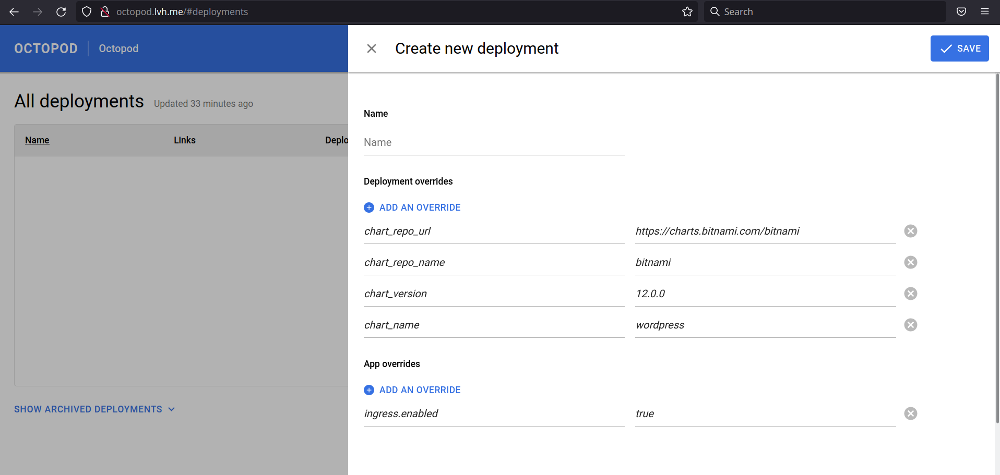

# Helm-based deployment guide

In this guide we'll show you how to deploy bitnami's [wordpress chart](https://github.com/bitnami/charts/tree/master/bitnami/wordpress) with Octopod.

## Your first deployment

### Install Octopod

Make sure that you have Octopod installed before going further. If you haven't, go check our [Octopod deployment guide](Octopod_deployment_guide.md).

Note: In this guide we assume that you have octopod installed on your local machine.
Open up Octopod in your browser and you'll see something like this:

### Create the deployment

Click on the _New Deployment_ button:

### The config

As you can see we filled some parameters for you ― it's very convinient, because you don't want fill URL to your private helm repo over and over again, right?

All these parameters can be modified at the chart level, [here](../../charts/octopod/values.yaml#L90) is an example. Or you can, of course, override them manually from the Octopod UI.

One thing is left to fill, though.

**Name** ― we've chosen `wordpress`, but you can choose whatever name you like.

Octopod loads all overrides from the [chart values](https://github.com/bitnami/charts/blob/master/bitnami/wordpress/values.yaml) dynamically for each chart you want to deploy.

Try to add new App override to see list of available keys for the wordpress chart.

### Deploy

When you have it all filled out. Click _Save_ button and wait until the deployment transitions to a _running_ state:

Now you can click on a _wordpress_ link in the _links_ section and you'll be redirected to your wordpress instance:

So here you have it, your first Octopod deployment!

## Going further

As we can said earlier you can override all default parameters using Octopod UI. Let's dive right in!

First, let's archive our wordpress deployment:

### The config

And create one more deployment, this time using a different set of overrides:

**Name:** octopod-internal

**App Overrides:**

|                   Key | Value                     |
| --------------------: | ------------------------- |
|  `octopod.baseDomain` | `octopod-internal.lvh.me` |
| `ingress.tls.enabled` | `false`                   |

**Deployment Overrides:**

|               Key | Value                                 |
| ----------------: | ------------------------------------- |
|      `chart_name` | `octopod`                             |
| `chart_repo_name` | `typeable`                            |
|  `chart_repo_url` | `https://typeable.github.io/octopod/` |
|   `chart_version` | `0.6.0`                               |

As in the previous example Octopod parsed the _App Overrides_ from the [chart values](../../charts/octopod/values.yaml), but the _Deployment Overrides_ are passed as configuration to the control scripts. You can read more about these parameters in the [control script docs](../../helm-control-scripts/README.md).

Now you have Octopod inside Octopod! Try to install your own chart with Octopod!
