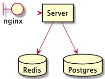
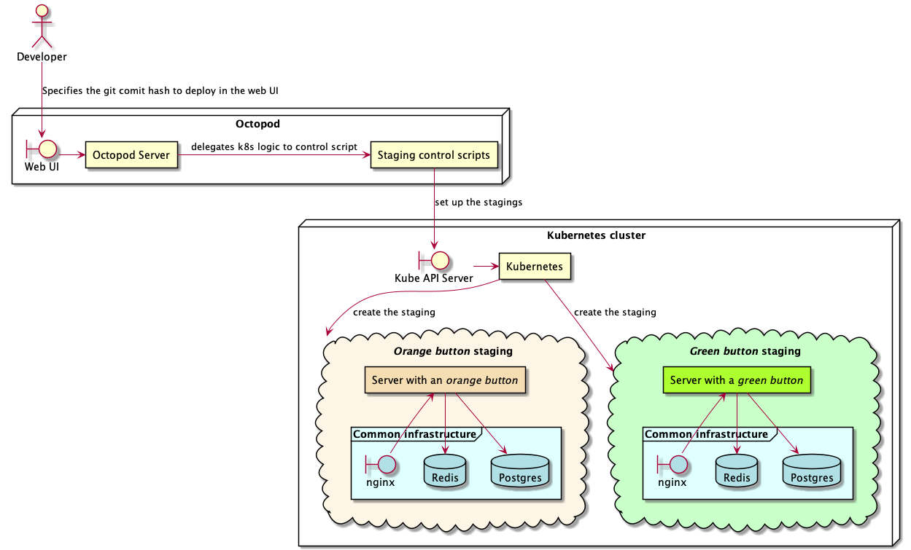

# Octopod overview

  
Table of contents

- [Intro](#intro)
- [🎯 The aim of Octopod](#-the-aim-of-octopod)
- [🔬 Example](#-example)
  - [💽 The server](#-the-server)
  - [🎨 Changing button colors](#-changing-button-colors)
  - [😖 Why have such a complicated staging deployment?](#-why-have-such-a-complicated-staging-deployment)
- [🛠 The way Octopod is set up](#-the-way-octopod-is-set-up)
- [🎛️ CLI](#️-cli)
- [🔒 Authentication in the UI](#-authentication-in-the-ui)
- [🤖 Automatic deployment / CD](#-automatic-deployment--cd)
- [📗 Glossary](#-glossary)

**NOTE: it is not recommended to use Octopod for managing production environments**

## Intro

_Octopod_ is a tool which implements the multi-staging deployment model (MSDM) on top of _Kubernetes_. _MSDM_ implies that every developed feature needs to be not only deployed in a separate environment for QA testing, but also needs to be updated when bugs found during testing are fixed and the feature is refined.

_Octopod_ exists to reduce the overhead in deploying and maintaining per-feature staging environments. This responsibility may otherwise fall to:

1. **DevOps engineers** – this might seem natural since deploying and updating systems in new environments is typically the task of a DevOps engineer who has experience in system administration. However, developers and QA engineers would be blocked for additional periods while DevOps engineers deal with the additional load.
2. **Developers** – they might take on the responsibility for deploying and maintaining their feature stagings ― this would most likely waste a lot of time since developers might not have the required experience.

The process of deploying and updating stagings is likely to be extremely similar across different developed features ― changing the behavior of a button and updating pricing calculations would probably be identical from the point of view of system administration ― a new version of the system needs to be deployed with the same default configuration (the staging configuration, as opposed to a production configuration).

## 🎯 The aim of Octopod

Octopod aims to extract the mentioned similarity between deploying different staging deployments while still allowing a certain amount of configuration where per-feature setup is still required. The result is a simple interface, which allows users to manage staging deployments without any system administration expertise or, for that matter, even without deep technical expertise.

## 🔬 Example

### 💽 The server

You are developing a server, which is accessed through [_nginx_](https://www.nginx.com), and the server needs access to a [*Postgres*](https://www.postgresql.org) database and a [*Redis*](https://redis.io) database

### 🎨 Changing button colors

Your server serves HTML to the browser, which displays two buttons. Both buttons currently have the same ugly color as the background, and you have two separate tasks: one task to change the first button be orange and another task to make the second button green. (Note that this is a toy example ― imagine that these are two separate complex tasks.)

Now imagine that two different developers each completed one of the tasks, and you are now deploying the new and updated version of your server to a staging environment. You are very surprised when you find that for some reason the background of the whole page suddenly became pink. Every developer says that they did not make the change, and yet it is there. (Here the background color changing to pink denotes an undesirable change, which impacts the product in significant and apparent ways, and was not made intentionally.)

A way to mitigate this situation is to test each feature separately, in its own staging deployment, and verify which change made the page background pink, and ideally, you would check each feature before merging them into the final product (merging it into the `master` branch, for example).

To check each feature before merging would require every developer to build the new version of the server, and set up all required services: [_nginx_](https://www.nginx.com), [*Postgres*](https://www.postgresql.org), [*Redis*](https://redis.io). Developers would also have to manage access to the set up environments ― set up SSL certificates, set up subdomains, make sure databases are not exposed, and make sure the connection between every component is secure and authenticated.

This is **a lot** of overhead just to test the color of a button. Note that most of the described work would be identical across the vast majority of features ― changing the deployment architecture is a relatively rare task in most projects. Databases, load balancing, caching, and proxying would be set up in much the same way for the majority of feature-specific stagings. The server itself is probably also compiled in exactly the same way for most features.

_Octopod_ aims to factor out the common parts of creating and deploying a staging.

If developers were using _Octopod_ to deploy stagings, literally the only thing needed from them would be to specify the git commit hash in the _Web UI_ of _Octopod_. The common infrastructure (shown in **blue**) which is the same across different stagings would not require any additional setup. The only difference between the two button feature staging would be the actual server that required changing the color. And that server is most likely also built in a uniform way, meaning it can be done automatically.

### 😖 Why have such a complicated staging deployment?

The purpose of having a staging deployment is to verify the correctness of an implementation of a task as it would behave in a production environment. After all, deploying in a production environment is the only real goal of implementing anything.

Having a staging deployment that is different from a production environment in any significant way can lead to unexpected behavior that was not obvious ― heavy caching of a request can lead to an inconsistent state and break a feature for example.

## 🛠 The way Octopod is set up

To integrate Octopod into your development workflow, a DevOps engineer needs to implement some common staging orchestration logic once for it to be reused by the whole development team. This can be done by implementing [*staging control scripts*](Control_scripts.md) in any programming language which can be executed in the Octopod environment. Statically linked executables don't depend on their environment at all, so languages such as [*Rust*](https://www.rust-lang.org) and [*Go*](https://golang.org) are a good fit.

When stagings are managed through the *Web UI*, *Octopod* executes appropriate _staging control scripts_ behind the scenes to set up your particular environment.

## 🎛️ CLI

For more in-depth control over the staging cluster, we also ship a CLI with _superuser privileges_ which allows a DevOps engineer to examine deployment logs to resolve issues, should they arise.

You can read more about the _octo CLI_ in the [octo CLI user guide](docs/../Octo_user_guide.md).

## 🔒 Authentication in the UI

Authentication to the _web UI_ can be set up through [_Ingress_](https://kubernetes.io/docs/concepts/services-networking/ingress/) which, for example, [supports OAuth authentication](https://kubernetes.github.io/ingress-nginx/examples/auth/oauth-external-auth/). This allows you to set up Octopod so that every developer in your GitHub organization has access to manage stagings without any additional permissions management.

## 🤖 Automatic deployment / CD

It is possible to set up your existing CI to automatically deploy new versions of your feature staging, reducing friction even further. This can be done by using the CLI to update a staging with the same name as the current branch in git for example. The CLI command can be executed straight in your CI script in services like GitHub Actions, Travis CI, Azure Pipelines, etc.

Fot more information see the [integration guide](Integration.md).

## 📗 Glossary

- _Octopod_ ― the deployment manager, this very system
- _octo CLI_ ― a command-line client, used to access Octopod with _superuser_ privileges
- _Octopod Server_ ― the server responsible for managing deployments
- _deployment control scripts_ ― scripts used to interact with your specific environment setup
- _web UI_ ― the interface developers, project managers, QA engineers, etc. use to manage stagings.
- _overrides_ ― a set of environment variable key-value pairs, which have precedence over the default pairs set up by DevOps engineer. These environment variables are passed to your system during deployment.
