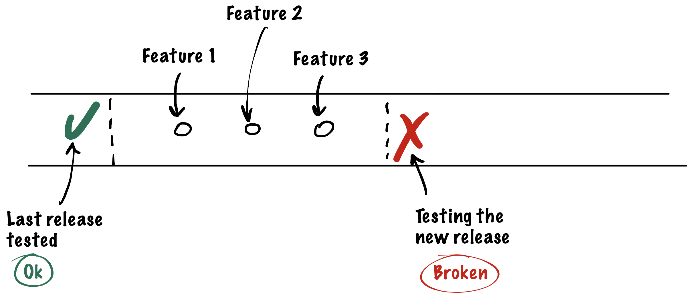

# Octopod Case Study

A deployment model is a critical part of any IT company and is usually
deeply integrated into multiple development processes. Having a good
deployment model lets successful companies create a well-tuned
development workflow – a key to fast and reliable delivery of business
features.

Development models may vary significantly from one company to another.
However, the problems companies are facing when picking the right model
are usually pretty common. We want new features to be tested rigorously
before they hit production and become available for end users. We also
want the team to deliver in a timely manner, which means the ideal
workflow should exclude any blockers that force one team to wait when
the other team finishes their work.

## The two models
### The 3-tiered model

A common approach is to have a 3-tier deployment model which implies
having Development, Staging, and Production Environments. Although there
could be some variations, basically this model is used in the majority
of development teams.

In such a 3-tier model, the Development server usually pulls the changes
from a master branch where developers merge their changes once they’re
done with the implementation in the feature branch. Once the branch is
merged, the feature can be seen and tested on the Development server. If
the change makes the application unstable or does not work as expected,
a developer has to revert it, push the fix and then redeploy. Once the
feature is verified, the new code is integrated into a Staging
environment.

Even though this flow is pretty common, it has few significant
downsides which we will examine later in this document.

### The multi-staging model

A more interesting approach is a multi-staging model where a new Staging
server is created for each new feature branch. Staging servers are
accessible by unique URLs, like my-cool-feature.staging.company.com, and
are used for both development and QA verification. Albeit from the
developer’s perspective the process is similar, with this approach each
feature can be implemented and tested independently without a need to be
merged into the master branch first, making the process of testing a
release candidate on the Pre-Production server independent.

## Breaking features

### The 3-tiered model

One issue is that no matter how well developers test their feature, it
may still interact with someone else’s code in unexpected ways. It means that a successful
verification of a particular feature on the Development server does not
guarantee that the feature won’t unexpectedly break someone else’s code.
If a critical part of the application, like authentication, gets broken,
this may block the testing process completely until the problem is
resolved. And to top it off, when this happens, it might not be
immediately clear whose change is to blame. Thus, everyone who did
recent merges begin looking into their code trying to see whether it was
their check-in that broke the server. Of course, it takes time and
blocks the development process as well until the culprit merge is found
and confirmed.

### The multi-staging model

With the multi-staging model every deployed staging is separated from a known-to-be-good commit by exactly one feature implementation or bug fix. This means that if at any point we discover that a staging contains a critical bug, we will for sure know which feature broke the project. The "bad" feature can be identified without delaying the merge of "good" branches.

## Configurable testing environments

Sometimes features require a special or dangerous environment to be tested in. For example, a feature might require handling a payment error that does not occur in the test payment processing environment, thus the feature will need to be tested in a production payment processing environment.

### The 3-tiered model

When QA is forced to test everything on a single staging deployment, by necessity all features tested during the deployment which includes the said feature will need to be tested in a production payment processing environment. This is bad at least because it increases the likelihood of unintentional charges and might complicate the testing of other features.

### The multi-staging model

With a multi-staging this issue is mitigated completely since every single feature is tested in a completely separate environment that can be set up the way the feature requires.

## Feature development lifecycle

### The 3-tiered model

Having features deployed and tested in wave-like cycles in tandem with the staging server being occupied by integration tests for a given release can increase the time interval between the developer submitting a feature for testing and getting feedback from QA. This leads to the developer losing the context of the task. Furthermore, an unfortunate series of events can significantly increase the time-to-production of a feature.

### The multi-staging model

With a multi-staging model the problem is lessened significantly. Allowing features to be deployed to staging environments independently reduces both the QA feedback time and the time-to-production of a feature under the same conditions.

> **NOTE:** Relative block widths have been kept consistent with the previous diagram.

## Octopod for the multi-staging model

While the multi-staging model has many upsides, having a dedicated Staging server for each new feature or bugfix usually
requires a more complicated environment and forces developers to spend
more time on deploying each piece of code. Difficulties in managing such
a swarm of servers often leads to introducing orchestration tools like
Kubernetes, which may not be easy to learn for everyone in the team,
especially when containers are built on top of AWS infrastructure which
implies using AWS-specific commands and tools. Thus, even though this
model provides a significant workflow improvement, it requires
developers to have certain DevOps expertise.

To overcome these limitations and let more teams use multi-staging
deployment models, we created Octopod. Octopod is a service
that, once installed and set up, supports your multi-tier development
workflow at a level that does not require deep technical knowledge. Octopod
simplifies the procedure of creating new servers and allows the
implementation of common CD solutions in just a few clicks.

 

  <i>Star the project of you like it</i>

<a href="https://typeable.io"></img></a>

