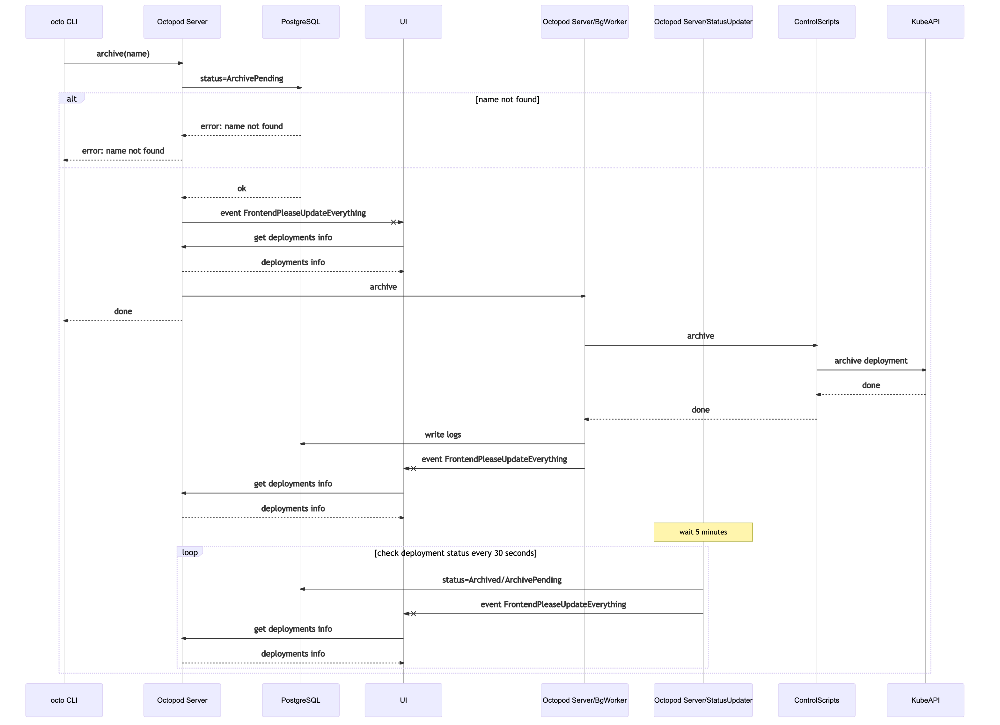
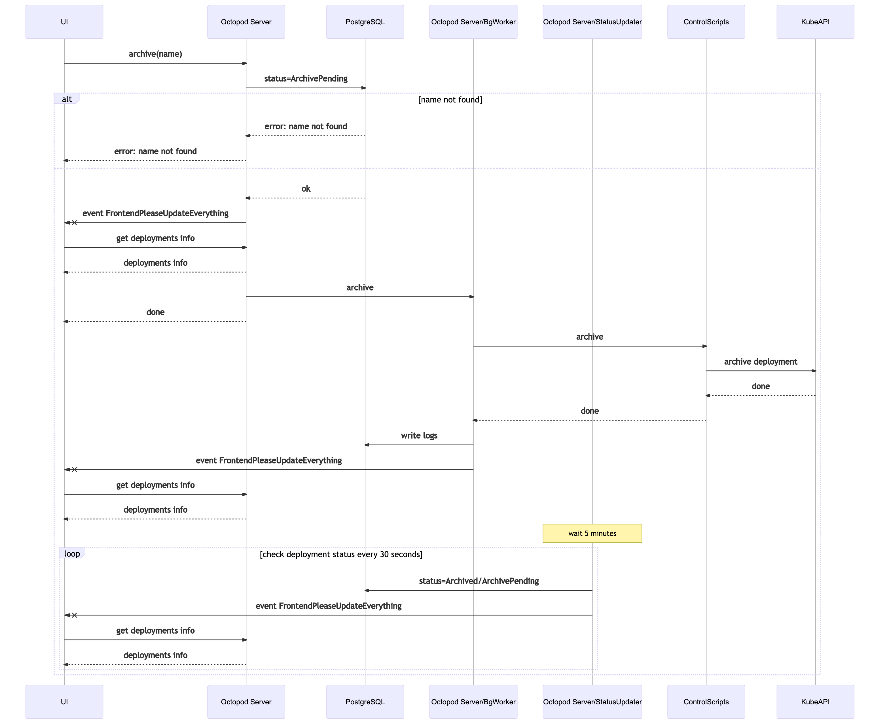
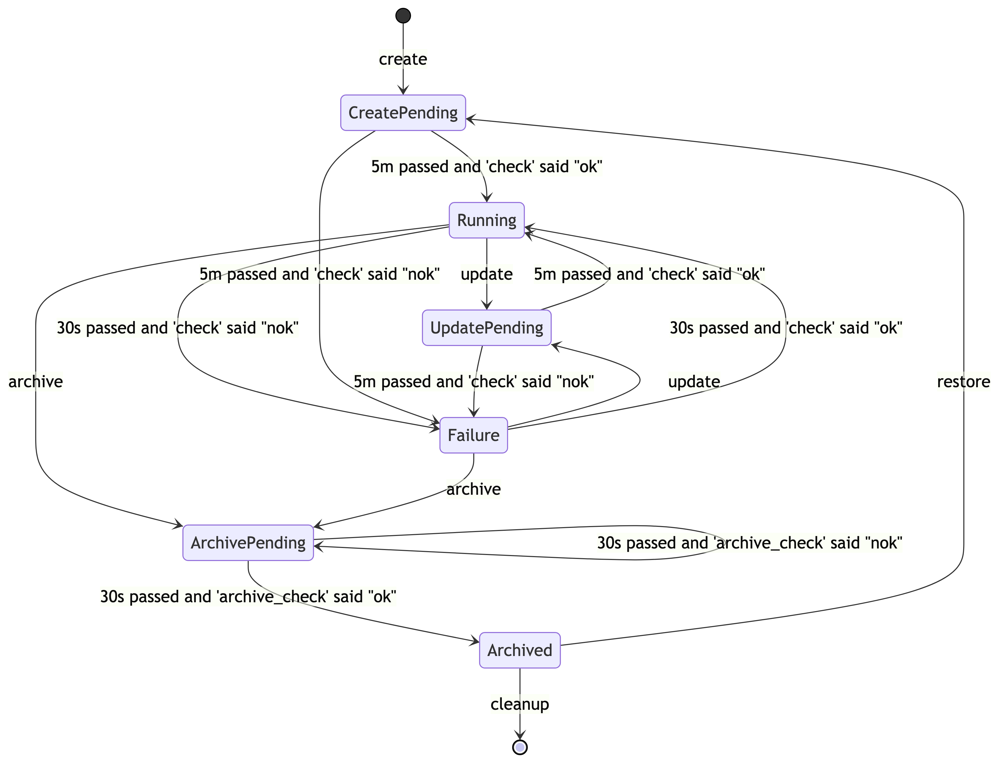

# Technical architecture

## ⚒️ Used tools

The main goal of _Octopod_ is to simplify deployment in [_Kubernetes_][kube].

When developing _Octopod_ we were expecting _Octopod_ itself to also be deployed with [_Kubernetes_][kube].

## 📐 App architecture

Users can interact with _Octopod_ through:
1. the [_Web UI_](#-web-ui) (expected to be used by developers, project managers, QA engineers, etc.)
2. the [_octo CLI_](#-octo-cli) (expected to be used by DevOps engineers and programmatically, e. g. on CI)

Interaction between _Octopod_ and [_Kubernetes_][kube] is done entirely through the [_control scripts_](#-control-scripts). This allows _Octopod_ to be adapted for use in practically any deployment setup.

_Octopod_ stores all data about deployments and all performed operations in [_PostgreSQL_](#-postgresql).


### 🖥 Web UI

_Web UI_ – the user interface used to manipulate deployments. It interacts with [_Octopod Server_](#-octopod-server) through HTTP/1.1 requests and receives events from [_Octopod Server_](#-octopod-server) through _Websockets_. Authentication between _Web UI_ and [_Octopod Server_](#-octopod-server) is done through Basic Auth. The Basic Auth token is read from a *JSON* config which is requested when the page is loaded. Access to the config should be configured through [_Ingress_][ingress].

The interface does not contain technical details related to administering deployments ― managing deployments is done in a simple way. The interface is geared towards being used by developers of any level, QA engineers, project managers, and people without a technical background.

### 🐙 Octopod Server

_Octopod Server_ – the server that processes deployment management requests and delegates [_Kubernetes_][kube]-specific logic to [_control scripts_](#-control-scripts).


The server receives commands from the [_octo CLI_](#-octo-cli) and the [_Web UI_](#-web-ui) through HTTP/1.1 and updates the state of deployments. The server also sends updates to the [_Web UI_](#-web-ui) through _Websockets_. _Octopod Server_ interacts with [_Kube API Server_](#kube-api-server) through the [_control scripts_](#-control-scripts). Settings, deployment states and user action logs are stored in [_PostgreSQL_](#-postgresql).

### 🐘 PostgreSQL

[_PostgreSQL_](https://www.postgresql.org) – DBMS used to store settings, deployment states and user action logs.

### 🎛 octo CLI

_octo CLI_ – a command-line interface used to manage deployments. It sends HTTP/1.1 requests to [_Octopod Server_](#-octopod-server). The requests are [authenticated through SSL certificates](Security_model.md#octo-cli-authentication).

It can perform all actions available in the [_Web UI_](#-web-ui), but also has access to view deployment logs.

The CLI is expected to be used by DevOps engineers, but can also be used if it is necessary to automate deployment management in some way, for example [in CI scripts](Integration.md).

### 📑 Control scripts

_Control scripts_ – a _Docker Container_ with executables which encapsulates all of the logic of interacting with the [_Kube API Server_](#kube-api-server), cloud providers, deployments, version control, etc.

This is necessary to make _Octopod_ itself independent from any particular deployment setup ― it can be set up to work with practically any setup.

When the [_Octopod Server_](#-octopod-server) _Pod_ starts, the contents of the *control scripts* container are copied into the _Octopod Server_ container file system. This means that the executables need to be either statically linked or interpreted through _Bash_ since it needs to be executed in the _Octopod Server_ container environment.

These [scripts need to be implemented](Control_scripts.md) to deploy _Octopod_.


### Kube API Server

[Kube API Server](https://kubernetes.io/docs/concepts/overview/kubernetes-api/) – an API server in [_Kubernetes_][kube] which should be called from [_control scripts_](#-control-scripts).

## 📦 Octopod Distribution model

[_octo CLI_](#-octo-cli) is distributed as a *statically linked executable*. The prebuilt binaries can be found in the "Releases" tab of the GitHub repository.

[_Octopod Server_](#-octopod-server) and [_Web UI_](#-web-ui) are distributed as a single _Docker Image_. [_Charts_][chart] are used [to deploy](Octopod_deployment_guide.md) it in [_Kubernetes_][kube].

A _Docker Image_ with [_control scripts_](#-control-scripts) should be provided by the user. They are available in [our _Docker Hub_ registry](https://hub.docker.com/orgs/typeable/repositories).

## Process view

Here we provide sequence diagrams for every basic operation that can be performed in _Octopod_. These operations call [_control scripts_](#-control-scripts). On the diagrams, they are labeled as _ControlScripts_.

### ✨ Create

_Create_ – creates a new deployment. The main inputs include the name of the deployment, the _Docker Image tag_ and optional configurations. A more detailed description can be found in the [control scripts documentation](Control_scripts.md#-create).

The arguments are forwarded to the [_create_](Control_scripts.md#-create) script which in turn creates the deployment in the _Kubernetes cluster_. It might call something like:

```bash
helm upgrade --install --namespace "$namespace" "$name" "$deployment_chart" \
    --set "global.project-name=$project_name" \
    --set "global.base-domain=$base-domain" \
    --set "app.tag=$tag" \
    --set "app.env.foo=$app_env_configuration_1" \
    --set "app.bar=$deployment_configuration_1" \
    --wait \
    --timeout 300
```

<details>
  <summary>Create via CLI sequence diagram</summary>


</details>

<details>
  <summary>Create via UI sequence diagram</summary>


</details>

### 🔧 Update

_Update_ – updates an existing deployment. The main inputs include the name of the deployment, the _Docker Image tag_ and optional configurations. A more detailed description can be found in the [control scripts documentation](Control_scripts.md#-update).

[_configurations_](Overview.md#configurations) are read from the database and merged with the new changes. All arguments are forwarded to the [_update_](Control_scripts.md#-update) script which in turn updates the specified deployment with the new parameters in the _Kubernetes cluster_. It might call something like:

```bash
helm upgrade --install --namespace "$namespace" "$name" "$deployment_chart" \
    --set "global.project-name=$project_name" \
    --set "global.base-domain=$base-domain" \
    --set "app.tag=$tag" \
    --set "app.env.foo=$app_env_configuration_1" \
    --set "app.bar=$deployment_configuration_1" \
    --wait \
    --timeout 300
```


<details>
  <summary>Update via CLI sequence diagram</summary>


</details>

<details>
  <summary>Update via UI sequence diagram</summary>


</details>

### 🗃 Archive

_Delete_ – archives a deployment. It should only free the computational resources (_Pods_). _Persistent Volumes_ should not be deleted ― they are cleared in the [_cleanup_](#-cleanup) process. This operation can be undone with the [_restore_](#-restore) command.

The main argument is the name that identifies the deployment. A more detailed description can be found in the [control scripts documentation](Control_scripts.md#-archive).

The arguments are forwarded to the [_delete_](Control_scripts.md#-archive) script which in turn frees the computational resources. It might call something like:

```bash
helm delete "$name" --purge
```

<details>
  <summary>Archive via CLI sequence diagram</summary>



</details>

<details>
  <summary>Archive via UI sequence diagram</summary>



</details>

### 🚮 Cleanup

_Cleanup_ – releases **all** resources captured by the deployment.

The main argument is the name that identifies the deployment. A more detailed description can be found in the [control scripts documentation](Control_scripts.md#-cleanup). It can only be called after [_archive_](#-archive) has been executed.

The arguments are forwarded to the [_cleanup_](Control_scripts.md#-cleanup) script which in turn frees all resources captured by the given deployment. It might call something like:

```bash
kubectl delete pvc -n "$namespace" "$name-postgres-pvc"
kubectl delete certificate -n "$namespace"  "$name-postgres-cert"
```

<details>
  <summary>Cleanup via CLI sequence diagram</summary>


</details>

<details>
  <summary>Cleanup via UI sequence diagram</summary>


</details>

### 🔁 Restore

_restore_ – restores an archived deployment in the state it was last in. Calls the same _script_ that is called in [_create_](#-create).

The main argument is the name that identifies the deployment. A more detailed description can be found in the [control scripts documentation](Control_scripts.md#-create). It can only be called after [_archive_](#-archive) has been executed.

All necessary setup information is read from the database: [_configurations_](Overview.md#configurations) and the _Docker Image tag_. The arguments are forwarded to the [_create_](Control_scripts.md#-create) script which in turn recreates the deployment. It might call something like:

```bash
helm upgrade --install --namespace "$namespace" "$name" "$deployment_chart" \
    --set "global.project-name=$project_name" \
    --set "global.base-domain=$base-domain" \
    --set "app.tag=$tag" \
    --set "app.env.foo=$app_env_configuration_1" \
    --set "app.bar=$deployment_configuration_1" \
    --wait \
    --timeout 300
```

<details>
  <summary>Restore via CLI sequence diagram</summary>


</details>

<details>
  <summary>Restore via UI sequence diagram</summary>


</details>

## 👨‍💻👩‍💻 How we use it

We deploy several separate [_Kubernetes_][kube] clusters:
- We have separate clusters for every product we deploy
- We also separate _production_ and _staging_ clusters

That makes two clusters per product.

So we get a cluster matrix similar to the following table, where each cell is a separate cluster:

|                     | Staging (Has _Octopod_ installed) | Production (_Octopod_ not installed) |
| ------------------- | --------------------------------- | ------------------------------------ |
| **Cactus shop**     | 🟩 🐙 Cluster *A*                   | 🟨 Cluster *B*                        |
| **Pottery service** | 🟦 🐙 Cluster *C*                   | 🟪 Cluster *D*                        |
| ...                 | ...                               | ...                                  |

Every color depicts a separate cluster. A 🐙 indicates that _Octopod_ is installed in that cluster.

Every _staging_ cluster has a separate _Octopod_ installation with separate interfaces to manage the deployments.

## 🗂️ Deployment state transitions

A deployment can exist in one of six states:
1. *Running*
2. *Failure*
3. *CreatePending*
4. *UpdatePending*
5. *DeletePending*
6. *Archived*

_Running_, _Failure_, _Archived_ states are "permanent", meaning the deployment is not in the process of executing a command.

*CreatePending*, *UpdatePending*, *DeletePending* states are temporary, meaning the deployment is currently in the process of executing a deployment command.



[kube]: https://kubernetes.io
[chart]: https://helm.sh/docs/topics/charts/
[ingress]: https://kubernetes.io/docs/concepts/services-networking/ingress/
