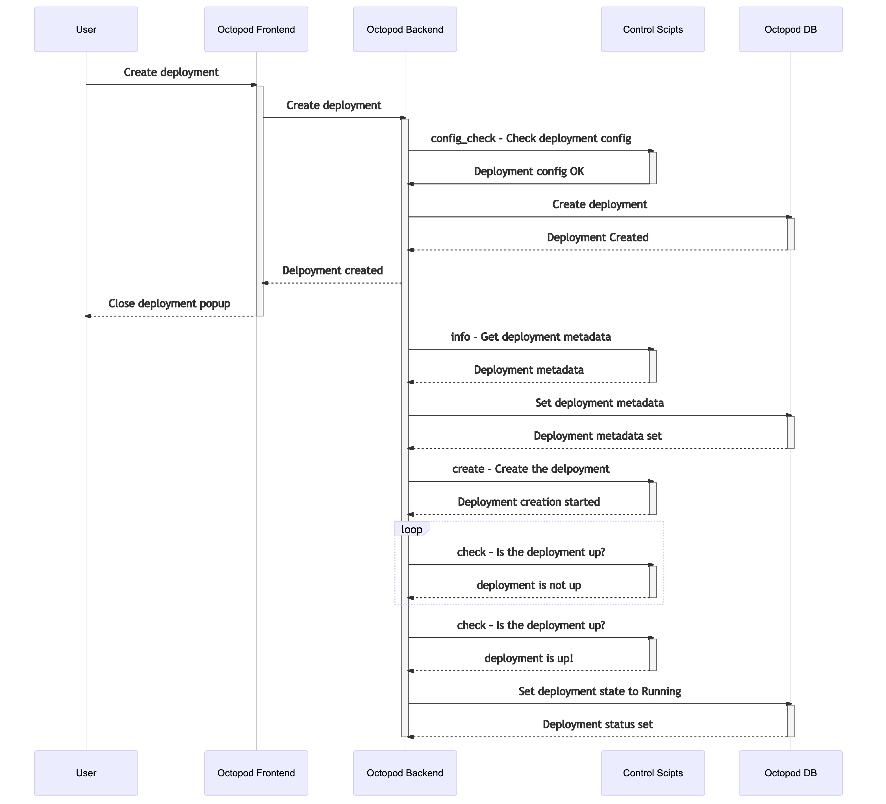
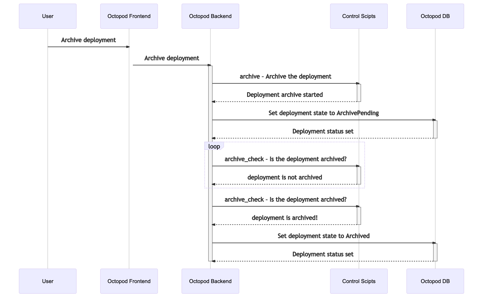

# Technical architecture

## ⚒️ Used tools

The main goal of _Octopod_ is to simplify deployment in [_Kubernetes_][kube].

When developing _Octopod_ we were expecting _Octopod_ itself to also be deployed with [_Kubernetes_][kube].

## 📐 App architecture

Users can interact with _Octopod_ through:
1. the [_Web UI_](#-web-ui) (expected to be used by developers, project managers, QA engineers, etc.)
2. the [_octo CLI_](#-octo-cli) (expected to be used by DevOps engineers and programmatically, e. g. on CI)

Interaction between _Octopod_ and [_Kubernetes_][kube] is done entirely through the [_control scripts_](#-control-scripts). This allows _Octopod_ to be adapted for use in practically any deployment setup.

_Octopod_ stores all data about deployments and all performed operations in [_PostgreSQL_](#-postgresql).

### 🖥 Web UI

_Web UI_ – the user interface used to manipulate deployments. It interacts with [_Octopod Server_](#-octopod-server) through HTTP/1.1 requests and receives events from [_Octopod Server_](#-octopod-server) through _Websockets_. Authentication between _Web UI_ and [_Octopod Server_](#-octopod-server) is done through Basic Auth. The Basic Auth token is read from a *JSON* config which is requested when the page is loaded. Access to the config should be configured through [_Ingress_][ingress].

The interface does not contain technical details related to administering deployments ― managing deployments is done in a simple way. The interface is geared towards being used by developers of any level, QA engineers, project managers, and people without a technical background.

### 🐙 Octopod Server

_Octopod Server_ – the server that processes deployment management requests and delegates [_Kubernetes_][kube]-specific logic to [_control scripts_](#-control-scripts).

The server receives commands from the [_octo CLI_](#-octo-cli) and the [_Web UI_](#-web-ui) through HTTP/1.1 and updates the state of deployments. The server also sends updates to the [_Web UI_](#-web-ui) through _Websockets_. _Octopod Server_ interacts with [_Kube API Server_](#kube-api-server) through the [_control scripts_](#-control-scripts). Settings, deployment states and user action logs are stored in [_PostgreSQL_](#-postgresql).

### 🐘 PostgreSQL

[_PostgreSQL_](https://www.postgresql.org) – DBMS used to store settings, deployment states and user action logs.

### 🎛 octo CLI

_octo CLI_ – a command-line interface used to manage deployments. It sends HTTP/1.1 requests to [_Octopod Server_](#-octopod-server). The requests are [authenticated through the `Authorization` header](Security_model.md#octo-cli-authentication).

It can perform all actions available in the [_Web UI_](#-web-ui), but also has access to view deployment logs.

The CLI is expected to be used by DevOps engineers, but can also be used if it is necessary to automate deployment management in some way, for example [in CI scripts](Integration.md).

### 📑 Control scripts

_Control scripts_ – a _Docker Container_ with executables which encapsulates all of the logic of interacting with the [_Kube API Server_](#kube-api-server), cloud providers, deployments, version control, etc.

This is necessary to make _Octopod_ itself independent from any particular deployment setup ― it can be set up to work with practically any setup.

When the [_Octopod Server_](#-octopod-server) _Pod_ starts, the contents of the *control scripts* container are copied into the _Octopod Server_ container file system. This means that the executables need to be either statically linked or interpreted through _Bash_ since it needs to be executed in the _Octopod Server_ container environment.

These [scripts need to be implemented](Control_scripts.md) to deploy _Octopod_ unless the set of generic scripts is used.

### Kube API Server

[Kube API Server](https://kubernetes.io/docs/concepts/overview/kubernetes-api/) – an API server in [_Kubernetes_][kube] which should be called from [_control scripts_](#-control-scripts).

## 📦 Octopod Distribution model

[_octo CLI_](#-octo-cli) is distributed as a *statically linked executable*. The prebuilt binaries can be found in the "Releases" tab of the GitHub repository.

[_Octopod Server_](#-octopod-server) and [_Web UI_](#-web-ui) are distributed as a single _Docker Image_. [_Charts_][chart] are used [to deploy](Octopod_deployment_guide.md) it in [_Kubernetes_][kube].

A _Docker Image_ with [_control scripts_](#-control-scripts) should be provided by the user. They are available in [our _Docker Hub_ registry](https://hub.docker.com/orgs/typeable/repositories).

## Process view

Here we provide sequence diagrams for every basic operation that can be performed in _Octopod_. These operations call [_control scripts_](#-control-scripts). On the diagrams, they are labeled as _Control Scripts_.

### ✨ Deployment creation

### 🔧 Deployment update

### 🗃 Archive

### 🚮 Cleanup

### 🔁 Restore

## 👨‍💻👩‍💻 How we use it

We deploy several separate [_Kubernetes_][kube] clusters:
- We have separate clusters for every product we deploy
- We also separate _production_ and _staging_ clusters

That makes two clusters per product.

So we get a cluster matrix similar to the following table, where each cell is a separate cluster:

|                     | Staging (Has _Octopod_ installed) | Production (_Octopod_ not installed) |
| ------------------- | --------------------------------- | ------------------------------------ |
| **Cactus shop**     | 🟩 🐙 Cluster *A*                   | 🟨 Cluster *B*                        |
| **Pottery service** | 🟦 🐙 Cluster *C*                   | 🟪 Cluster *D*                        |
| ...                 | ...                               | ...                                  |

Every color depicts a separate cluster. A 🐙 indicates that _Octopod_ is installed in that cluster.

Every _staging_ cluster has a separate _Octopod_ installation with separate interfaces to manage the deployments.

## 🗂️ Deployment state transitions

A deployment can exist in one of six states:
1. *Running*
2. *Failure*
3. *CreatePending*
4. *UpdatePending*
5. *DeletePending*
6. *Archived*

_Running_, _Failure_, _Archived_ states are "permanent", meaning the deployment is not in the process of executing a command.

*CreatePending*, *UpdatePending*, *DeletePending* states are temporary, meaning the deployment is currently in the process of executing a deployment command.

[kube]: https://kubernetes.io
[chart]: https://helm.sh/docs/topics/charts/
[ingress]: https://kubernetes.io/docs/concepts/services-networking/ingress/

 

  <i>Star the project of you like it</i>

<a href="https://typeable.io"></img></a>

