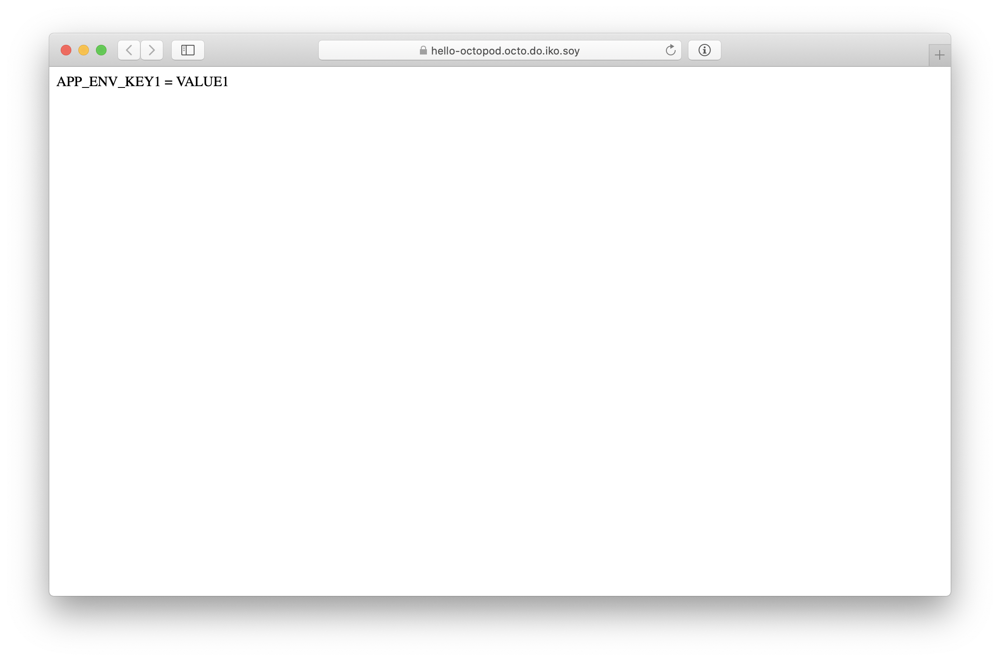
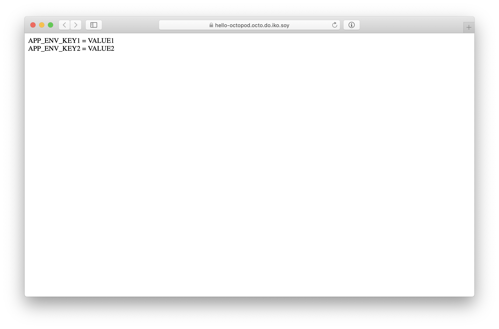
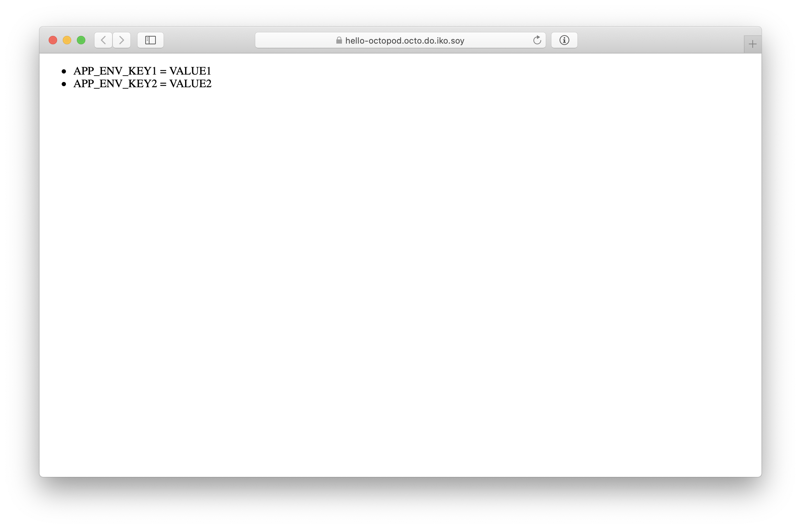

# Helm-based deployment guide

## Подгодовка

Предполагается, что у вас в системе уже установлен Docker,
а также Вы установили _Octopod_. Если Вы _Octopod_ не установили, то пожалуйста воспользуйтесь [инструкцией по установке _Octopod_](Octopod_deployment_with_K8S.md).
При установке _Octopod_ потребуется указать название образа с [control scripts](Control_scripts.md):
```bash
--set "global.utils_image_prefix=typeable" \
--set "global.utils_image=octopod-helm-example" \
--set "global.utils_image_tag=1.0" \
```

В итоге должно получиться что-то вроде:

```bash
helm upgrade octopod ./octopod \
	--install \
	--namespace octopod \
	--set "global.deploy_checksum=$sha256_sum" \
	--set "global.image_prefix=typeable"  \
	--set "global.image_tag=1.0" \
	--set "global.utils_image_prefix=typeable" \
	--set "global.utils_image=octopod-helm-example" \
	--set "global.utils_image_tag=1.0" \
	--set "global.acme_registration_email=certbot@example.com" \
	--set "global.auth_url=https://oauth.exmaple.com/oauth2/auth" \
	--set "global.auth_signin=https://oauth.exmaple.com/oauth2/start?rd=/redirect/$http_host$request_uri" \
	--set "project_name=MyProject" \
	--set "domain=octopod.example.com" \
	--set "app_domain=octopod-app.example.com" \
	--set "power_app_domain=octopod-power-app.example.com" \
	--set "ws_domain=octopod-ws.example.com" \
	--set "base_domain=example.com" \
	--set "status_update_timeout=600" \
	--wait \
	--timeout 600 \
	--debug
```

Для того чтобы развернуть приложение с помощью _Octopod_ потребуется само приложение и набор [control scripts](Control_scripts.md).
Разворачивать можно через _Web UI_ или _octo CLI_. В этом примере мы будем использовать только _octo CLI_.
Также потребуется Docker для запуска контейнера с _octo CLI_.
Перед использованием _octo CLI_ необходимо настроить доступ к _Octopod_, пожалуйста воспользуйтесь [руководством пользователя _octo CLI_](Octo_user_guide.md).

В качестве примера мы будем использовать простое веб приложение, которое обслуживает единственный endpoint `/`.
По запросу на `/` будет возвращаться список переменных окружения, имена которых начинаются с `APP_ENV`, в HTML разметке.
С исходным кодом приложения можно ознакомиться, перейдя по ссылке [web-app](../../examples/web-app).
Это приложение было упаковано в докер образ и отправлено в регистри:
```bash
docker build -f docker/Dockerfile -t typeable/octopod-web-app-example:v1 .
docker push typeable/octopod-web-app-example:v1
```

Также мы будем производить обновление приложения до более новой версии.
В новой версии изменена HTML разметка: каждая переменная окружения выводится не в отдельном `div`, а в виде элемента списка `li`.
С исходным кодом обновленного приложения можно ознакомиться, перейдя по ссылке [web-app-v2](../../examples/web-app-v2).
Это приложение было упаковано в докер образ и отправлено в регистри:
```bash
docker build -f docker/Dockerfile -t typeable/octopod-web-app-example:v2 .
docker push typeable/octopod-web-app-example:v2
```

Для работы веб приложению нужен 1 TLS сертификат для каждого развертывания. [_Cert Manager_][cert-manager] создает сертификаты через [_Let’s Encrypt_][lets-encrypt].
У [_Let’s Encrypt_][lets-encrypt] есть лимиты на создание сертификатов [_Let’s Encrypt Rate Limits_][lets-encrypt-rate-limits].
При достижении лимита `too many registrations for this IP` может помочь перемещение Pod [_Cert Manager_][cert-manager] на другую ноду.

Набор [control scripts](Control_scripts.md) будет использовать helm v2.x, kubectl, kubedog для управления и проверки статуса деплойментов.
С исходным кодом [control scripts](Control_scripts.md) можно ознакомиться, перейдя по ссылке [helm-based-control-scripts](../../examples/helm-based-control-scripts).
Набор [control scripts](Control_scripts.md) был упакован в докер образ и отправлен в регистри:

```bash
docker build -f docker/Dockerfile -t typeable/octopod-helm-example:1.0 .
docker push typeable/octopod-helm-example:1.0
```
**Примечание:**
В нашем примере используется Stateless приложение упакованное в один chart.
Так что для создания и обновления необходимо выполнить один набор команд (`helm upgrade --install ...`).
Поэтому [control scripts](Control_scripts.md) реализован только `create`, и он же используется вместо `update`.
В случае более сложного приложения упакованного в несколько chart-ов, возможно потребуется выполнить различный набор команд,
это потребует реализации различных `create` и `update` скриптов.

## Создание нового deployment

Для создания достаточно выполнить
```bash
octo create -n hello-octopod -t v1 -e APP_ENV_KEY1=VALUE1
```

- `-n hello-octopod` ― название deployment.
- `-t v1` ― тег deployment.
- `-e APP_ENV_KEY1=VALUE1` ― переменная окружения уровня приложения.

Эта команда вызовет `create` из [control scripts](Control_scripts.md), a `create` вызовет `helm`.
Спустя некоторое время Вы увидите созданный _Pod_ нового deployment
```
$ kubectl get pods -n deployment
NAME                              READY   STATUS    RESTARTS   AGE
app-hello-octopod-8965856-qbwvq   1/1     Running   0          15s
```

Если откроете в браузере `http://hello-octopod.<домен, указанный при развертывании Octopod>` Вы увидите



## Добавление новой переменной окружения уровня приложения

Для добавления новой переменной уровня приложения достаточно выполнить
```bash
octo update -n hello-octopod -t v1 -e APP_ENV_KEY2=VALUE2
```

- `-n hello-octopod` ― название deployment.
- `-t v1` ― тег deployment.
- `-e APP_ENV_KEY2=VALUE2` ― переменная окружения уровня приложения.

Эта команда вызовет `create` из [control scripts](Control_scripts.md), `create` вызовет `helm` (Смотри примечание раздела _Подготовка_).
Спустя несколько секунд, если откроете в браузере `http://hello-octopod.<домен указанный при развертывании Octopod>` Вы увидите новую переменную окружения уровня приложения:



## Обновление версии приложения

Для обновления приложения до новой версии достаточно выполнить
```bash
octo update -n hello-octopod -t v2
```

- `-n hello-octopod` ― название deployment.
- `-t v2` ― тег deployment.

Эта команда вызовет `create` из [control scripts](Control_scripts.md), `create` вызовет `helm` (Смотри примечание раздела _Подготовка_).
Спустя несколько секунд, если откроете в браузере `http://hello-octopod.<домен указанный при развертывании Octopod>` Вы увидите обновленную HTML разметку:



## Увеличение количества реплик через установку переменной окружения уровня deployment

Для добавления новой переменной достаточно выполнить
```bash
octo update -n hello-octopod -t v2 -o replicas=3
```

- `-n hello-octopod` ― название deployment.
- `-t v1` ― тег deployment.
- `-o replicas=3` ― переменная окружения уровня deployment.

Эта команда вызовет `create` из [control scripts](Control_scripts.md), `create` вызовет `helm` (Смотри примечание раздела _Подготовка_).

Спустя некоторое время Вы увидите, что количество _Pod_-ов стало 3
```bash
$ kubectl get pods -n deployment
NAME                              READY   STATUS    RESTARTS   AGE
app-hello-octopod-8965856-qbwvq   1/1     Running   0          97m
app-hello-octopod-8965856-v585c   1/1     Running   0          15s
app-hello-octopod-8965856-v88md   1/1     Running   0          15s
```

Если откроете в браузере `http://hello-octopod.<домен указанный при развертывании Octopod>`, Вы увидите, что приложение продолжает обсуживать запросы:


[cert-manager]: https://cert-manager.io/docs
[lets-encrypt]: https://letsencrypt.org
[lets-encrypt-rate-limits]: https://letsencrypt.org/docs/rate-limits
