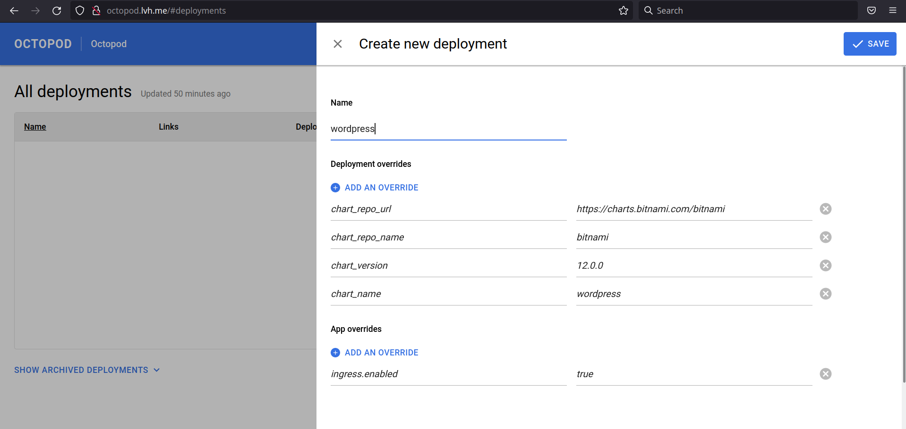
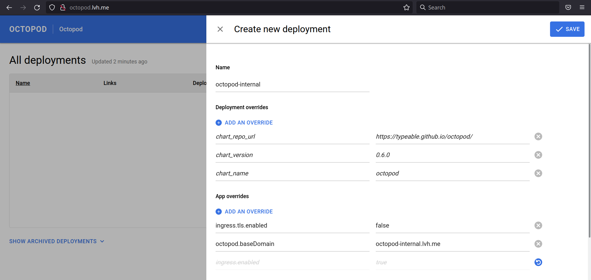

# Установка Helm чартов с помощью Octopod

В этой инструкции вы узнаете как установить [чарт wordpress](https://github.com/bitnami/charts/tree/master/bitnami/wordpress) от bitnami с помощью Octopod.

## Ваш первый Deployment

Прежде чем проолжить убедитесь, что уже установили Octopod, воспользовавшись нашей [инструкцией](Octopod_deployment_guide.md).
Обратите внимание, что в этой инструкции мы предполагаем, что вы установили Octopod локально.

Открыв Octopod в вашем браузере вы увидите следующее:

Нажмите на кнопку New Deployment

Тут вы можете заполнить все параметры для вашего Deployment'. Давайте же их заполним!

Name ― мы выбрали `wordpress`, но вы можете выбрать любое другое имя.

Tag ― `5.8.0`. Мы взяли его из [параметров чарта](https://github.com/bitnami/charts/blob/master/bitnami/wordpress/Chart.yaml#L4)

App Overrides:
`ingress.enabled: true`
`ingress.hostname: wordpress.lvh.me`

Эти параметры мы взяли из [документации чарта](https://github.com/bitnami/charts/tree/master/bitnami/wordpress#traffic-exposure-parameters). Вы можете поставить любые параметры указанные там.

После того, как вы всё заполнили, нажмите на кнопку Save и дождитесь пока Deployment перейдёт в состояние Running.

Теперь вы можете нажать на ссылку `wordpress` в столбце Links и будете переаправлены на ваш инстанс wordpress.

Поздравляю, вы создали свой первый Deployment в Octopod!

## Идём дальше

Сейчас у вас скорее всего возник вопрос как Octopod установил чарт из репозитория bitnami, хотя мы не указывали вооюзе никаких параметров для их репозитория? Всё потому, что мы установили эти настройки на уровне чарта [тут](../../charts/octopod/values.yaml#L90).
Но вы можете переопределить все эти параметры. Давайте же приступим!

Сначала отправим уже ненужный Deployment с wordpress в архив.

И создадим ещё один новый Deployment, но теперь уже с другим списком Overrides.

Name: octopod-internal

Tag: 1.3.1

App Overrides:

`octopod.baseDomain: octopod-internal.lvh.me`
`ingress.tls.enabled: false`

Deployment Overrides:

`chart_name: octopod`
`chart_repo_name: typeable`
`chart_repo_url: https://typeable.github.io/octopod/`
`chart_version: 0.5.1`

Точно так же как и в предыдущем примере все параметры мы взяли из [документации чарта](../../charts/octopod/README.md#Parameters), но Deployment Overrides это параметры для скриптов управления. Чтобы узнать больше про скрипты ознакомьтесь с [этой документацией](../../helm-control-scripts/README.md).

Теперь у вас есть Octopod в Octopod'е! Осталось только установить свой helm чарт.

