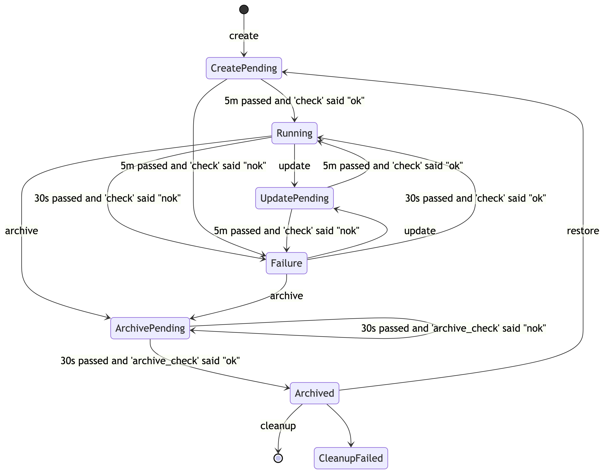

# Technical architecture

<details>
  <summary>Table of contents</summary>

- [Used tools](#used-tools)
- [App architecture](#app-architecture)
  - [UI](#ui)
  - [Octopod Server](#octopod-server)
  - [PostgreSQL](#postgresql)
  - [octo CLI](#octo-cli)
  - [Скрипты управления развертываниями (control scripts)](#скрипты-управления-развертываниями-control-scripts)
  - [Clean Archive CronJob](#clean-archive-cronjob)
  - [Kube API Server](#kube-api-server)
- [Octopod Distribution model](#octopod-distribution-model)
- [Process view](#process-view)
  - [Create](#create)
    - [Create via CLI](#create-via-cli)
    - [Create via UI](#create-via-ui)
  - [Update](#update)
    - [Update via CLI](#update-via-cli)
    - [Update via UI](#update-via-ui)
  - [Archive](#archive)
    - [Archive via CLI](#archive-via-cli)
    - [Archive via UI](#archive-via-ui)
  - [Cleanup](#cleanup)
    - [Cleanup via CLI](#cleanup-via-cli)
    - [Cleanup via UI](#cleanup-via-ui)
  - [Restore](#restore)
    - [Restore via CLI](#restore-via-cli)
    - [Restore via UI](#restore-via-ui)
- [How we use it](#how-we-use-it)
- [Deployment state transitions](#deployment-state-transitions)

</details>

## Used tools

Основная цель *Octopod* ― упрощение управления разными развертываниями сервисов в [_Kubernetes_][kube].

При разработке рассчитывалось, что сам _Octopod_ тоже будет разворачиваться при помощи [_Kubernetes_][kube].

## App architecture

Взаимодействовать с _Octopod_ возможно либо через веб-интерфейс (рассчитано на использование разработчиками, PM, QA и т. д.), либо через консольный клиент [_octo CLI_](#octopod-server) (рассчитано на использования DevOps инженерами и программно, например в CI).

Все взаимодействие _Octopod_ с самими развертываниями производится через [_скрипты управления развертываниями (control scripts)_](#скрипты-управления-развертываниями-control-scripts), которые передаются ему при запуске. Это позволяет сделать _Octopod_ очень гибким ― его возможно настроить для работы с практически в любой организацией развертываний.

Все данные об окружениях развертываний и всех операция совершаемых над ними _Octopod_ хранит в базе данных [_PostgreSQL_](#postgresql).


### UI

_UI_ – веб интерфейс,
используется для управления развертываниями посредством отправки команд управления развертываниями.
Взаимодействует с [_Octopod Server_](#octopod-server) посредством отправки HTTP/1.1 запросов, а также получает
события от [_Octopod Server_](#octopod-server) по _Websocket_. Между _UI_ и [_Octopod Server_](#octopod-server) Basic Auth. Написан на Haskell и Reflex-Dom.

В интерфейсе нет технических деталей системной администрации и оркестрации ― работа с развертываниями производится очень просто. Интерфейс рассчитан на использование разработчиками любого уровня, QA инженерами, PM, а так же людьми без ИТ образования.

### Octopod Server

_Octopod Server_ – непосредственно сам сервер, который обрабатывает запросы работы с развертываниями и делегирует базовые операции, модифицирующие развертывания, [_скриптам управления стеджингами (control scripts)_](#скрипты-управления-развертываниями-control-scripts).

Сервер обрабатывает
команды управления развертываниями от [_octo CLI_](#octopod-server) и [_UI_](#ui), обновляет состояние развертываний.
[_octo CLI_](#octopod-server) и [_UI_](#ui) взаимодействуют с ним путем отправки HTTP/1.1 запросов.
Сервер шлет событие обновления на [_UI_](#ui) по _Websocket_. Сервер взаимодействует с [_Kube API Server_](#kube-api-server)
через [_скрипты управления развертываниями (control scripts)_](#скрипты-управления-развертываниями-control-scripts). Для хранения настроек и статусов развертываний,
и логов действий пользователей используется [_PostgreSQL_](#postgresql). Написан на Haskell. Для работы
с развертываниями использует [_скрипты управления развертываниями (control scripts)_](#скрипты-управления-развертываниями-control-scripts).

### PostgreSQL

[_PostgreSQL_](https://www.postgresql.org) – РСУБД для хранения настроек и статусов развертываний, и логов
действий пользователей.

### octo CLI

_octo CLI_ – консольный клиент
используется для управления развертываниями посредством отправки команд управления
развертываниями. Взаимодействует с [_Octopod Server_](#octopod-server) посредством отправки HTTP/1.1 запросов.
Написан на Haskell. Между _octo CLI_ и [_Octopod Server_](#octopod-server) аутентификация по сертификату,
новый сертификаты создается вовремя каждой сборки и упаковываются в контейнеры с _octo CLI_ и [_Octopod Server_](#octopod-server).

В нем можно делать все операции, которые можно делать в [_UI_](#ui), но также есть доступ к расширенным операциям над развертываниями, таким как просмотр логов деплоя, что может быть полезно при диагностике возникающих проблем.

Этот клиент рассчитан на использование DevOps инженерами.

Его также можно использовать если необходимо автоматизировать управление развертываниями. Например, при настройке автоматического обновления развертываний при успешно пройденном CI.

### Скрипты управления развертываниями (control scripts)

_Скрипты управления развертываниями (control scripts)_ – контейнер с исполняемыми файлами, в которые инкапсулирована
логика работы с [_Kube API Server_](#kube-api-server), облачными провайдерами, развертываниями, системами контроля версий и т.д.

Они нужны для того, чтобы _Octopod_ не был завязан на какую-то конкретную организацию развертываний ― его можно настроить для работы с практически любой организацией развертываний.

Во время старта пода [_Octopod Server_](#octopod-server) содержимое контейнера с утилитами копируется в ФС контейнера с [_Octopod Server_](#octopod-server),
поэтому исполняемые файлы должны быть либо интерпретируемы через _Bash_, либо статически слинкованны.
Логику исполняемых файлов предлагается реализовать пользователям _Octopod_ (смотри [_Control scripts_](Control_scripts.md)).

### Clean Archive CronJob

_Clean Archive CronJob_ – CronJob, которая запускается раз в час и через [_octo CLI_](#octopod-server) удаляет заархивированные развертывания старее 14 дней.

Это сделано из-за того что при архивировании развертываний удаляются только вычислительные его части, _persistent volumes_ не удаляются, и при необходимости развертывание возможно восстановить в том виде, в котором он был до архивирования. Такая возможность пропадает по истечению 14 дней с момент его архивирования.

### Kube API Server

[Kube API Server](https://kubernetes.io/docs/concepts/overview/kubernetes-api/) – сервис на стороне [_Kubernetes_][kube], к которому должны обращаться [_скрипты управления развертываниями (control scripts)_](#скрипты-управления-развертываниями-control-scripts).

## Octopod Distribution model

[_octo CLI_](#octo-cli) в виде статически слинкованного исполняемого файла. Собранные исполняемые файлы доступны во вкладке "Releases" этого проекта на GitHub.

[_Octopod Server_](#octopod-server) и [_UI_](#ui) поставляются упаковынными в один Docker образ. Для [развертывания](Octopod_deployment_with_K8S.md) в [_Kubernetes_][kube] используется набор [_Chart_][chart]-ов. Образы доступны в [нашем registry на _Docker Hub_](https://hub.docker.com/orgs/typeable/repositories).

Docker образ [_скриптов управления развертываниями (control scripts)_](#скрипты-управления-развертываниями-control-scripts) пользователь _Octopod_ собирает сам.

## Process view

Далее здесь для справки приводятся схемы последовательностей для каждой из базовых операция работы с развертываниями. При их исполнении вызываются [_скрипты управления развертываниями (control scripts)_](#скрипты-управления-развертываниями-control-scripts). На схеме они помечены как _ControlScripts_.

### Create

_create_ – создание нового развертывания.
  В качестве аргументов принимаются `name`, `tag` и опциональные `overrides` (уровня App или Deployment, открытие или секретные).

  Переданные аргументы вместе с `project-name`, `base-domain`, `namespace` передаются в качестве аргументов в `create` из [_скриптов управления развертываниями (control scripts)_](#скрипты-управления-развертываниями-control-scripts).
  `create` создает новое развертывание в кластере используя полученные аргументы.
  Например, он может выполнять:

```bash
helm upgrade --install --namespace "$namespace" "$name" "$deployment_chart" \
    --set "global.project-name=$project_name" \
    --set "global.base-domain=$base-domain" \
    --set "app.tag=$tag" \
    --set "app.env.foo=$app_env_override_1" \
    --set "app.bar=$deployment_override_1" \
    --wait \
    --timeout 300
```

#### Create via CLI


#### Create via UI


### Update

_update_ – обновление существующего развертывания.
  В качестве аргументов принимаются `name`, `tag` и опционально изменения `overrides` (уровня App или Deployment, открытие или секретные).

  Затем из базы достаются `overrides` (уровня App или Deployment, открытие или секретные), они мерджатся с изменениями `overrides`
  и передаются вместе с `project-name`, `base-domain`, `namespace` в качестве аргументов в `update` из [_скриптов управления развертываниями (control scripts)_](#скрипты-управления-развертываниями-control-scripts).
  `update` обновляет существующее развертывание в кластере используя полученные аргументы.
  Например, он может выполнять:

```bash
helm upgrade --install --namespace "$namespace" "$name" "$deployment_chart" \
    --set "global.project-name=$project_name" \
    --set "global.base-domain=$base-domain" \
    --set "app.tag=$tag" \
    --set "app.env.foo=$app_env_override_1" \
    --set "app.bar=$deployment_override_1" \
    --wait \
    --timeout 300
```


#### Update via CLI


#### Update via UI


### Archive

_delete_ – архивирование существующего развертывания.
  Производится удаление только подов, Persistent Volumes (диски) сохраняются. Отменить действие этой команды можно с помощью команды restore.
  В качестве аргументов принимается `name`.

  `name` вместе с `project-name`, `base-domain`, `namespace` передаются в качестве аргументов в `archive` из [_скриптов управления развертываниями (control scripts)_](#скрипты-управления-развертываниями-control-scripts).
  `archive` удаляет существующее развертывание в кластере, используя полученные аргументы.
  Например он может выполнять:

```bash
helm delete "$name" --purge
```


#### Archive via CLI


#### Archive via UI


### Cleanup

_cleanup_ – полная очистка развертывания.
  В качестве аргументов принимаeтся `name`.

  Например, можно удалять сертификаты, Persistent Volume Claim и Persistent Volumes.

  `name` вместе с `project-name`, `base-domain`, `namespace` передаются в качестве аргументов в `cleanup` из [_скриптов управления развертываниями (control scripts)_](#скрипты-управления-развертываниями-control-scripts).
  `cleanup` выполняет освобождение ресурсов в кластере, которые ранее использовались одним из удаленных развертываний.
  Например, он может выполнять:

```bash
kubectl delete pvc -n "$namespace" "$name-postgres-pvc"
kubectl delete certificate -n "$namespace"  "$name-postgres-cert"
```

#### Cleanup via CLI


#### Cleanup via UI


### Restore

_restore_ – восстановление заархивированного развертывания с последними настройками.
  В качестве аргументов принимается `name`.

  Из базы достаются недостающие для восстановления `tag` и опциональные `overrides` (уровня App или Deployment, открытие или секретные). Они передаются вместе с `project-name`, `base-domain`, `namespace` в качестве аргументов в `restore` из [_скриптов управления развертываниями (control scripts)_](#скрипты-управления-развертываниями-control-scripts).
  `restore` выполняет восстановление в кластере ранее удаленного развертывания используя полученные аргументы.
  Например, он может выполнять:

```bash
helm upgrade --install --namespace "$namespace" "$name" "$deployment_chart" \
    --set "global.project-name=$project_name" \
    --set "global.base-domain=$base-domain" \
    --set "app.tag=$tag" \
    --set "app.env.foo=$app_env_override_1" \
    --set "app.bar=$deployment_override_1" \
    --wait \
    --timeout 300
```

#### Restore via CLI


#### Restore via UI


## How we use it

Мы используем несколько кластеров [_Kubernetes_][kube]: отдельный кластер для каждого приложения, а так же разделяем по кластерам _production_ и _deployment_ окружения.

В каждый _deployment_ кластер мы устанавливаем _Octopod_, через _Octopod_ осуществляем разворачивание различных версий deployment'ов необходимых для QA.

## Deployment state transitions

Существует 6 статусов развертываний:
1. *Running*
2. *Failure*
3. *CreatePending*
4. *UpdatePending*
5. *DeletePending*
6. *Archived*

_Running_, _Failure_, _Archived_ являются постоянными, т.е. развертывание уже не находится в режиме выполнения команды.

*CreatePending*, *UpdatePending*, *DeletePending* являются переходными, т.е. развертывание находится в режиме выполнения команды.



<!-- [kubectl]: https://kubernetes.io/docs/reference/kubectl/ -->
<!-- [helm]: https://helm.sh -->
<!-- [kubedog]: https://github.com/werf/kubedog -->
[kube]: https://kubernetes.io
[chart]: https://helm.sh/docs/topics/charts/
